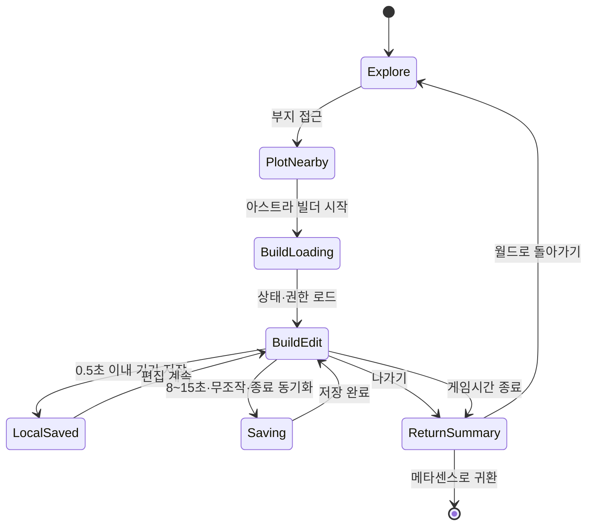

# 아스트라 빌더 제품·UI/UX·개발 설계

작성일: 2026-07-23  
대상: 메타센스 아스트라 프론티어  
권장 기능명: **아스트라 빌더**  
권장 장소명: **별빛 건축실** 또는 **자유 건축 부지**

## 0. 최종 결론

아스트라 프론티어를 마인크래프트형 복셀 월드로 교체하지 않는다.

현재 구현된 행성 지형, 강, 다리, 길, 착륙장, 생태 구역, 탐사 구역, 친구 광장과 실시간 방문 구조는 유지한다. 여기에 학생이 직접 블록과 모듈을 조합하는 작은 편집 구역을 추가한다.

최종 제품 정의는 다음과 같다.

> 평화로운 아스트라 행성 안의 보호된 작은 부지에서, 학생이 블록과 모듈로 자신의 기지와 휴식 공간을 만들고 친구와 함께 가꾸는 창작 시스템

구조는 세 층으로 분리한다.

1. **고정 월드 층**
   - 현재의 지형, 강, 다리, 길, 착륙장, 주요 동선
   - 학생이 파괴하거나 수정하지 못함

2. **랜드마크 층**
   - 현재의 별빛 램프, 관측소, 로버 정비소, 온실 등
   - 기존 `planet.layout`과 `buildGalaxyItem`을 유지
   - 광석과 탐사 재료로 해금·배치하는 큰 시설

3. **자유 건축 부지 층**
   - POC는 12 × 12 × 10, 검증 후 MVP는 16 × 16 × 12로 확대
   - 기본 블록은 해금 후 자유 사용
   - 별도 저장·버전·권한 시스템 사용

이 구조라면 기존 아스트라의 완성도 높은 자연 환경과 사회적 기능을 버리지 않으면서 학생이 실제 제작자가 될 수 있다.

### 0.1 외부 검토 의견의 선별 반영

현재 코드와 15분 세션 정책에 대조한 결과 다음을 채택한다.

- POC 부지는 기존 원형 평탄지에 맞는 12 × 12 × 10으로 축소한다.
- MVP 저장은 청크가 아니라 하나의 작은 바이너리 상태와 단일 revision으로 시작한다.
- IndexedDB는 빠르게, 서버는 8~15초·무조작·종료 이벤트 중심으로 저장한다.
- 블록 그리드와 GLB 모듈·장식 배열을 처음부터 분리한다.
- 작은 2층 건축, 기본 계단·창문·조명은 무료 핵심 경험으로 제공한다.
- 태블릿 터치는 `건축`과 `카메라` 모드를 명확히 분리한다.
- 편집 초안과 친구에게 보이는 공개본을 UX에서도 분리하고 기본 공개 범위는 비공개로 한다.
- 빌더 기능 개발과 아바타·랜드마크 품질 개선을 병렬 작업 축으로 운영한다.

다음 의견은 방향을 유지하되 범위를 조정해 반영한다.

- 16 × 16 × 12는 폐기하지 않고 POC 통과 후 인공 플랫폼을 넓혀 적용한다.
- 스마트폰은 보기 전용으로 제한하지 않고 하나 배치·삭제·색상·장식 같은 간단 수정까지만 제공한다.
- 청크·연산 로그는 삭제하지 않고 32 × 32 이상, 부분 스트리밍 또는 동시 편집이 필요할 때 도입한다.
- AI의 계단·출입구·지지 구조 검사는 저장 차단이 아니라 선택 가능한 개선 제안으로 처리한다.

---

## 1. 현재 구현 상태에 대한 판단

### 1.1 이미 재사용할 수 있는 기반

현재 코드에는 새 게임을 처음부터 만들 필요가 없을 만큼 많은 기반이 있다.

| 현재 자산 | 코드 | 아스트라 빌더에서의 역할 |
| --- | --- | --- |
| React Three Fiber 월드 | `GalaxyWorld3D.jsx` | 건축 모드와 블록 렌더러를 붙일 루트 |
| 절차적 지형·강·길·평탄지 | `GalaxyTerrainModel.js`, `GalaxyTerrain3D.jsx` | 그대로 유지할 고정 월드 |
| 1·3인칭 이동과 카메라 | `GalaxyWorld3D.jsx`의 `Astronaut` | 탐험 모드 유지, 건축 모드 카메라 분기 |
| 시설 배치 미리보기 | `FrontierScene`, `WorldTerrain` | 블록 고스트와 배치 판정에 재사용 |
| 행성 소유자·방문자 구분 | `MetaGalaxy.jsx` | 편집 권한의 출발점 |
| 실시간 행성 방문 | `useGalaxyWorldPresence` | 향후 공동 건축의 기반 |
| 안전한 공개 텍스트 검증 | `functions/galaxyGame.js` | 건축물 이름·설명·표지판 검증 |
| 게임 시간 제한 | `useGalaxyPlaySession`, `GalaxyPlayTimeUI` | 자동 저장·안전 귀환과 결합 |
| 소리 의미 체계 | `SoundManager`, 프론티어 음원 카탈로그 | 배치·삭제·실패·저장 피드백 |
| Firestore·Functions 트랜잭션 | `functions/galaxyGame.js` | 서버 검증과 중복 요청 방지 |

### 1.2 현재 건설 시스템의 성격

현재 건설은 자유 건축이 아니라 **완성품 카탈로그 배치형**이다.

- 서버 카탈로그에서 시설을 선택한다.
- 학습 광석과 게임 재료를 지불한다.
- 평평한 위치를 클릭한다.
- 시설 하나가 `planet.layout` 배열에 추가된다.
- 시설 총수는 서버에서 36개로 제한된다.
- 배치된 시설은 하나의 2D 반경으로 충돌 처리된다.

이 구조는 관측소나 로버 정비소 같은 랜드마크에 적합하다. 수백 개 블록을 편집하는 용도로 확장하면 다음 문제가 생긴다.

- 블록마다 비용이 발생해 실험을 방해한다.
- `planet.layout` 배열과 행성 루트 문서가 커진다.
- 객체마다 React 컴포넌트와 Mesh를 만들면 드로콜이 급증한다.
- 현재의 원형 충돌은 내부 공간, 문, 계단, 2층을 표현할 수 없다.
- 시설별 Cloud Function 호출은 연속 편집에 너무 느리다.

따라서 기존 건설 시스템을 없애지 않고 **랜드마크 건설**로 이름과 역할을 명확히 하고, 자유 건축은 별도 엔진과 데이터 모델로 만든다.

### 1.3 실제 화면 점검 결과

2026-07-23 배포 화면을 PC, 태블릿, 스마트폰 크기에서 직접 점검했다.

좋은 점:

- 월드의 강, 길, 착륙장, 구역 배치가 한눈에 읽힌다.
- 행성 이름, 자원, 시간, 목표, 하단 명령 독의 역할이 구분된다.
- 건설 카탈로그의 시설 설명과 재료 출처가 비교적 충실하다.
- 귀환 브리핑과 안전 귀환 화면이 15분 정책과 잘 연결되어 있다.

개선이 필요한 점:

- 현재 캐릭터와 시작 시설은 기본 도형 조합이 강하게 보인다.
- 건설 메뉴가 월드를 덮는 긴 전체 화면 모달이라 선택과 실제 배치가 분리된다.
- 태블릿에서는 건설 미리보기와 재료 도감, 카탈로그가 긴 세로 문서가 된다.
- 스마트폰에서는 상단 시간·시점·귀환 UI와 목표 카드가 겹치거나 잘린다.
- 스마트폰 건설 메뉴는 첫 시설 설명만 화면 대부분을 차지한다.
- “건설”이 완성품 구매인지 자유 제작인지 사용자가 미리 구분하기 어렵다.

아스트라 빌더에서는 건축 중 기존 미니맵, 목표 카드, 방문 프롬프트, 하단 월드 독을 숨기고 건축에 필요한 정보만 남겨야 한다.

---

## 2. 제품 목표와 비목표

### 2.1 목표

1. 학생이 15분 안에 눈에 보이는 작은 변화를 만든다.
2. 블록을 놓고 지우는 데 비용 불안을 느끼지 않는다.
3. 현재 행성의 화풍과 성능을 유지한다.
4. PC와 태블릿에서 본격 편집이 가능하다.
5. 스마트폰에서는 감상과 하나 배치·삭제 중심의 간단 수정과 이어 만들기가 가능하다.
6. 종료·새로고침·네트워크 단절 뒤에도 작업이 복구된다.
7. 장기적으로 비동기 협력과 AI 블루프린트를 붙일 수 있다.

### 2.2 비목표

- 무한 복셀 월드
- 지형 파괴와 채굴
- 생존, 배고픔, 전투, 몬스터
- 수백 종의 블록
- 복잡한 제작 조합표
- 레드스톤형 자동화
- 1차 출시부터 완전 실시간 공동 편집
- 자유형 AI 3D 메시를 월드에 직접 삽입
- 블록 하나를 놓을 때마다 광석 차감

---

## 3. 월드 적용 설계

### 3.1 기존 맵을 그대로 쓰는 방법

현재 월드의 반지름은 `20`, 일반 시설 건설 반지름은 `14.2`다. 고정 구역은 다음과 같이 배치되어 있다.

- 착륙장: `[0, 5]`
- 주거 구역: `[-7.5, -4.5]`
- 생태 구역: `[6.8, -6.2]`
- 탐사 구역: `[8.7, 5.4]`
- 친구 광장: `[-8.8, 7]`

첫 자유 건축 부지는 **주거 구역의 기존 평탄지**를 사용한다.

현재 주거 구역에는 `SettlementVillage`가 절차적으로 채우는 작은 집 네 채와 비콘이 있다. 이 집들은 사용자 데이터가 아니라 배경 장식이므로 다음과 같이 점진적으로 교체할 수 있다.

1. 빌더 기능이 없는 행성은 기존 마을을 그대로 표시한다.
2. 빌더 베타가 활성화된 행성은 주거 구역 마을 대신 빈 기초 플랫폼을 표시한다.
3. 첫 입장 시 개척자 돔과 길은 유지하고, 마을 자리만 자유 건축 부지로 전환한다.

이 방식은 강, 길, 산, 다리, 탐사 노드와 충돌하지 않고 현재 맵의 의미도 유지한다.

### 3.2 첫 부지 규격

기존 주거 평탄지의 반지름은 `3.15`다. `16 × 16`, `cellSize 0.34`인 정사각형은 한 변이 `5.44`, 반대각선이 약 `3.85`이므로 원형 평탄지 안에 들어가지 않는다. 따라서 POC와 MVP의 규격을 분리한다.

POC 논리 그리드:

```ts
const BUILDER_POC_PLOT = {
  id: "habitat-b01",
  center: [-7.5, -4.5],
  width: 12,
  depth: 12,
  height: 10,
  cellSize: 0.34,
  maxBlocks: 360,
};
```

POC 월드 크기:

- 가로·세로 약 4.08
- 중심에서 모서리까지 약 2.89
- 최대 높이 약 3.4
- 최대 블록 300~400개 범위

이 규격은 현재 원형 평탄지 안에 약 `0.26`의 가장자리 여유를 남긴다. 2개 층을 각각 4~5셀 높이로 구성해 작은 기지, 온실, 전망대를 시험할 수 있다.

POC에서 조작성·성능·재방문 의향이 확인되면 기초 플랫폼을 반지름 `4.0~4.2` 이상 또는 5.44 정사각형으로 확장하고 다음 MVP 규격을 사용한다.

```ts
const BUILDER_MVP_PLOT = {
  width: 16,
  depth: 16,
  height: 12,
  cellSize: 0.34,
  maxBlocks: 500,
};
```

부지의 바닥은 지형을 실제로 바꾸지 않는다. `terrainHeight()` 위에 얇은 기초 플랫폼을 놓고, 모든 셀 좌표는 이 플랫폼의 로컬 좌표로 계산한다.

### 3.3 좌표 변환

```ts
type GridPosition = { x: number; y: number; z: number };

function gridToWorld(plot, cell) {
  const halfX = plot.width * plot.cellSize * 0.5;
  const halfZ = plot.depth * plot.cellSize * 0.5;
  return [
    plot.center[0] - halfX + (cell.x + 0.5) * plot.cellSize,
    plot.baseY + cell.y * plot.cellSize,
    plot.center[1] - halfZ + (cell.z + 0.5) * plot.cellSize,
  ];
}
```

부지 자체에 `rotation`을 둘 수 있지만 MVP에서는 `0°`로 고정한다. 회전 부지는 향후 강가·공동 부지를 추가할 때만 연다.

### 3.4 편집 가능한 것과 보호할 것

편집 가능:

- 부지 내부 블록
- 부지에 연결된 모듈과 장식
- 건축물 이름·설명
- 부지 공개 범위

편집 불가:

- 지형 높이
- 강과 다리
- 도로
- 착륙장
- 탐사 포털과 자원 노드
- 루미 가이드와 로버
- 행성 경계
- 다른 부지

---

## 4. 건축 콘텐츠 설계

### 4.1 MVP 기본 블록 8종

| ID | 이름 | 역할 |
| --- | --- | --- |
| `lumen_wall` | 루멘 벽 | 기본 구조 |
| `foundation_floor` | 기초 바닥 | 바닥과 데크 |
| `nebula_glass` | 성운 유리 | 창문 |
| `half_panel` | 반 블록 | 단차와 가구 |
| `slope_panel` | 경사 블록 | 지붕 |
| `stair_block` | 계단 | 층 이동 |
| `thin_panel` | 얇은 판 | 칸막이·난간 |
| `star_light` | 별빛 조명 | 발광 포인트 |

색상은 처음부터 자유 색상표를 주지 않는다. 각 행성 테마와 어울리는 4~6개 검증된 변형만 제공한다.

### 4.2 2차 건축 모듈

- 둥근 출입문
- 곡면 창문
- 돔 지붕
- 우주기지 벽
- 연결 통로
- 발코니
- 난간
- 소형 승강기
- 온실 프레임
- 착륙 데크

모듈은 셀 그리드에 맞춰 스냅되지만 하나의 GLB 객체로 렌더링한다.

### 4.3 3차 장식

- 식물
- 의자
- 테이블
- 모니터
- 표지판
- 작은 로봇
- 조각상
- 펫 휴식대

장식은 충돌이 없거나 단순 박스 충돌만 사용한다. 반복 장식은 인스턴싱한다.

---

## 5. 경제 설계

### 5.1 현재 랜드마크 경제는 유지

별빛 램프, 관측소, 로버 정비소, 항로문 같은 큰 시설은 현재 방식대로 학습 광석과 탐사 재료를 사용한다.

### 5.2 자유 건축은 능력 해금형

기본 원칙:

- 기본 블록 세트는 무료
- 삭제 시 손실 없음
- 동일 부지 안에서 해금한 재료는 무제한 사용
- 광석은 블록 수가 아니라 새로운 표현 능력을 연다

권장 예시:

| 항목 | 가격 예시 | 효과 |
| --- | ---: | --- |
| 기본 건축 세트 | 무료 | 작은 2층·계단·창문·조명·기본 8종 |
| 고층 건축 기술 | 1,500 | 3층 이상 높이 제한 해제 |
| 성운 유리 세트 | 600 | 유리 변형 4종 |
| 자동문 모듈 | 800 | 작동형 문 |
| 곡면 기지 세트 | 1,000 | 돔·곡면 벽 |
| 강가 부지 허가 | 1,200 | 두 번째 부지 |
| 오로라 조명 테마 | 700 | 조명·색조 세트 |

탐사 재료는 일회성 블록 비용보다 **테마 연구**에 사용한다.

예:

- 수정 유리 8개 → 성운 유리 세트 연구
- 바이오 섬유 10개 → 온실 모듈 연구
- 혜성 합금 10개 → 자동문·승강기 연구

---

## 6. UX 상태 흐름



### 6.1 탐험 모드

평상시에는 현재처럼 캐릭터로 이동한다.

부지 가까이에서만 다음 프롬프트를 표시한다.

```txt
별빛 건축실 B-01
184 / 500 블록 · 마지막 편집 어제
[아스트라 빌더 시작]
```

현재의 `E` 상호작용 체계를 재사용할 수 있다.

### 6.2 건축 모드 진입

진입 애니메이션:

1. 캐릭터가 부지 가장자리에 멈춘다.
2. 카메라가 0.4~0.6초 동안 위로 이동한다.
3. 월드 HUD를 축소한다.
4. 부지 경계와 그리드를 표시한다.
5. 마지막 사용 도구와 재료를 복원한다.

진입 중에는 네트워크에서 부지 메타데이터와 단일 현재 상태를 병렬 로드한다. 1초 이상 걸리면 스켈레톤 대신 “설계도 동기화 중” 한 줄만 표시한다.

### 6.3 건축 모드 화면

현재의 큰 건설 카탈로그 모달을 편집 화면으로 사용하지 않는다.
아래 사용량 예시는 16 × 16 MVP 기준이며, 12 × 12 POC에서는 분모를 `360`으로 표시한다.

데스크톱:

```txt
┌ B-01 · 별빛 관측 기지 ─ 자동 저장됨 ─ 184/500 ─ [나가기] ┐
│ [배치]                                      [되돌리기]      │
│ [삭제]             3D 건축 부지              [다시실행]      │
│ [색칠]                                      [영역]          │
│ [복사]                                      [대칭]          │
├───────────────────────────────────────────────────────────┤
│ 기본 | 벽 | 창문 | 지붕 | 조명 | 모듈                     │
│ [벽] [바닥] [유리] [경사] [계단] [조명]                    │
└───────────────────────────────────────────────────────────┘
```

태블릿:

- 상단: 이름, 저장, 사용량, 나가기
- 중앙: 건축 부지
- 하단 1열: 현재 도구와 되돌리기
- 하단 2열: 재료 카테고리와 최근 재료 5개
- 상세 재료는 짧은 바텀 시트

스마트폰:

- 미니맵 숨김
- 목표 카드 숨김
- 기존 월드 하단 독 숨김
- 상단 HUD는 `저장 · 184/500 · 나가기`만 유지
- 중앙 건축 화면을 최우선
- `건축`과 `카메라` 전환
- 하나 배치·삭제·색상 변경·장식 배치
- 오른쪽 아래 되돌리기
- 하단 재료 5개와 `전체` 버튼
- 영역 채우기·복사·대칭·다층 범위 지정은 제공하지 않음
- PC·태블릿에서 만든 큰 구조를 확인하고 간단히 이어 만드는 역할

### 6.4 조작

데스크톱:

- 클릭: 현재 도구 적용
- 드래그: 선·벽·바닥 범위 지정
- `Q` / `E`: 회전
- `Ctrl/Cmd + Z`: 되돌리기
- `Ctrl/Cmd + Shift + Z` 또는 `Ctrl/Cmd + Y`: 다시 실행
- `Esc`: 도구 해제 또는 건축 모드 나가기 확인

태블릿·스마트폰은 화면 상단에 명시적인 모드 전환을 둔다.

```txt
[건축] [카메라]
```

- 건축 모드: 한 손가락 탭으로 배치, 드래그는 향후 범위 도구에만 사용
- 카메라 모드: 한 손가락 드래그로 회전, 두 손가락으로 확대·축소와 이동
- 어떤 모드인지 색뿐 아니라 아이콘과 텍스트로 항상 표시
- 삭제는 명시적 삭제 도구 사용
- 길게 누르기는 보조 기능으로만 사용

건축 모드에서는 카메라 회전을, 카메라 모드에서는 블록 변경을 막는다. 삭제를 길게 누르기에만 의존하지 않는다. 어린 학생은 탭·드래그·길게 누르기를 쉽게 혼동하므로 약간의 손가락 이동은 탭 허용 오차로 처리한다.

### 6.5 핵심 도구

MVP:

- 하나 배치
- 하나 삭제
- 회전
- 색상 변형
- 30단계 되돌리기·다시 실행
- 자동 저장

MVP+:

- 선
- 사각형 바닥
- 벽
- 영역 채우기
- 선택 영역 복사
- 90도 회전
- 좌우 반전
- 대칭 모드
- 같은 층 복제

### 6.6 짧은 세션과 귀환

현재 `playRemainingSeconds`와 `warningStage`를 그대로 사용한다.

| 남은 시간 | 동작 |
| --- | --- |
| 5분 | “새 작업보다 현재 층을 마무리해 보세요” |
| 2분 | 새 대형 영역 채우기·층 복제 비활성화 |
| 1분 | 로컬 저장 확인, 서버 동기화 주기 최대 5초로 단축 |
| 0분 | 입력 즉시 잠금, pending 전체를 final commit 1회로 전송, 귀환 요약 |

종료 문구:

> 오늘 2층 전망창과 별빛 조명을 만들었어요.  
> 모든 작업이 안전하게 저장되었습니다.

보상 숫자보다 오늘 바뀐 공간을 보여주는 것이 핵심이다.

---

## 7. 카메라와 이동 설계

### 7.1 건축 카메라

기본은 현재 `OrbitControls`를 재사용하되 건축 부지 중심으로 제한한다.

- 타깃: 부지 중심
- 최소 거리: 부지 너비의 0.7배
- 최대 거리: 부지 너비의 1.8배
- 최소 극각: 25°
- 최대 극각: 68°
- 팬 범위: 부지 경계 + 1셀
- 기본 시점: 45° 사선 탑다운
- 선택 기능: 직교 카메라 보기

건축 중 캐릭터 이동과 1·3인칭 전환은 중지한다. 캐릭터는 부지 입구에 세워 두거나 숨기고, 월드 복귀 시 다시 활성화한다.

### 7.2 건축물 안 걷기

현재 캐릭터 Y 좌표는 `walkSurfaceHeight()`로 지형과 다리만 따라간다. 기존 시설은 원형 반경 전체가 장애물이므로 내부에 들어갈 수 없다.

따라서 내부 걷기는 별도 단계로 구현한다.

MVP:

- 건축 편집과 외부 전시
- 문은 시각적 모듈
- 완성 건축물 내부 자유 이동은 베타 범위에서 제외

2차:

- 셀 점유 기반 벽 충돌
- 현재 발 높이 주변에서 가장 가까운 보행 가능 표면 탐색
- 계단 블록은 경사 표면 제공
- 문은 열림 상태에서 충돌 제거
- 1층과 2층을 연결하는 계단 검증

보행 판정 API:

```ts
type WalkQuery = {
  x: number;
  z: number;
  currentY: number;
  radius: number;
  stepHeight: number;
};

function getBuilderWalkSurface(plot, query): {
  blocked: boolean;
  surfaceY: number;
  material: "metal" | "glass" | "wood" | "soft";
};
```

현재 발걸음·충돌 사운드의 표면 카탈로그와 연결할 수 있다.

---

## 8. 캐릭터 업그레이드 설계

### 8.1 현재 문제

현재 로컬·원격 우주인은 `sphereGeometry`, `capsuleGeometry`, `boxGeometry`를 JSX에서 직접 조합한다.

장점은 가볍다는 것이지만 다음 한계가 있다.

- 실루엣이 기본 도형처럼 보인다.
- 얼굴과 감정 표현이 약하다.
- 배치·삭제·감탄 같은 행동 애니메이션을 붙이기 어렵다.
- 로컬 캐릭터와 원격 캐릭터 코드가 중복된다.
- 커스터마이징 확장이 어렵다.

### 8.2 권장 아트 방향

마인크래프트 캐릭터처럼 각지게 만들 필요는 없다.

권장 스타일:

- 둥글고 친근한 소형 탐험가
- 큰 헬멧과 읽기 쉬운 바이저
- 짧은 팔다리와 명확한 손동작
- 아스트라의 청록·보라 발광 포인트
- 저채도 수트 + 사용자가 고르는 한 가지 강조색
- 펫과 나란히 섰을 때 한 가족처럼 보이는 비율

### 8.3 기술 사양

| 항목 | 권장 |
| --- | --- |
| 포맷 | GLB / glTF 2.0 |
| 압축 | Meshopt 우선, 필요 시 Draco |
| LOD0 | 8k~14k triangles |
| LOD1 | 3k~6k triangles |
| 텍스처 | 1 × 1024 atlas, 필요 시 512 |
| 본 | 20~35 bones |
| 월드 키 | 약 1.45 world units |
| 애니메이션 | idle, walk, run, place, remove, wave, inspect |

이미 `@react-three/drei`가 있으므로 `useGLTF`, `useAnimations`, `Clone`을 활용할 수 있다.

### 8.4 컴포넌트 구조

```txt
GalaxyAvatar/
├─ GalaxyAvatar.jsx
├─ GalaxyAvatarRig.jsx
├─ GalaxyAvatarAnimator.jsx
├─ GalaxyAvatarAppearance.js
├─ GalaxyAvatarLOD.jsx
└─ galaxyAvatarCatalog.js
```

로컬과 원격 캐릭터는 같은 모델을 사용한다.

```tsx
<GalaxyAvatar
  appearance={appearance}
  locomotion={locomotion}
  action={activeAction}
  remote={false}
  lod="auto"
/>
```

이동·충돌 캡슐은 렌더 모델과 분리한다. 모델이 바뀌어도 게임 물리는 동일하게 유지해야 한다.

### 8.5 커스터마이징 범위

1차:

- 수트 강조색
- 바이저 색
- 백팩 3종
- 가슴 배지
- 펫 동행 여부

2차:

- 헬멧 장식
- 장갑·부츠 세트
- 크루 패치
- 학습으로 얻은 실제 칭호 홀로그램

자유 이미지 스킨 업로드는 아동 안전과 화풍 문제 때문에 제공하지 않는다.

---

## 9. 오브젝트 업그레이드 설계

### 9.1 현재 문제

`StructureModel`은 아이템 ID별 `if` 분기 안에 기본 Three.js 도형을 직접 조합한다.

- 한 파일이 계속 커진다.
- 시설마다 충돌·음향·앵커 정보가 분산된다.
- GLB와 절차적 모델을 함께 관리하기 어렵다.
- LOD와 자산 버전을 통제하기 어렵다.

### 9.2 카탈로그 기반 레지스트리

```ts
type StructureAssetDefinition = {
  itemId: string;
  assetVersion: number;
  modelUrl?: string;
  fallback: "procedural";
  scale: number;
  footprint: number;
  collision: Array<
    | { kind: "box"; center: [number, number, number]; size: [number, number, number] }
    | { kind: "cylinder"; center: [number, number, number]; radius: number; height: number }
  >;
  interactionAnchor: [number, number, number];
  acousticMaterial: "metal" | "glass" | "wood" | "soft";
  lod?: { near: number; far: number };
};
```

기존 아이템 ID는 유지한다. GLB 로드 실패 시 현재 절차적 모델을 fallback으로 보여준다.

### 9.3 GLB 제작 규격

- 원점: 바닥 중앙
- Y-up
- 정면: +Z
- 실측 스케일 통일
- 재질 1~2개
- 텍스처 아틀라스
- 투명 재질 최소화
- 조명은 실제 PointLight보다 발광 재질 우선
- 반복 소품은 별도 노드로 분리
- 충돌용 저해상도 노드 이름: `COLLIDER_*`
- 상호작용 지점 노드 이름: `ANCHOR_INTERACT`
- 문·안테나 등 애니메이션 노드 이름 고정

### 9.4 업그레이드 우선순위

1. 학생 아바타와 원격 아바타
2. 개척자 돔
3. 루미·로버
4. 현재 주거 구역의 임시 집
5. 관측소·온실·로버 정비소
6. 나무·수정·생태 소품
7. 빌더 모듈과 장식

첫 화면에 보이는 자산부터 바꿔야 체감 품질이 빠르게 올라간다.

---

## 10. 블록 렌더링 설계

### 10.1 하지 말아야 할 구조

```tsx
blocks.map((block) => <mesh key={block.id}>...</mesh>)
```

500개 블록을 500개 Mesh와 React 노드로 만들지 않는다.

### 10.2 MVP 구조

POC와 MVP의 논리 데이터는 부지 전체를 나타내는 하나의 `Uint16Array`로 관리한다. 이 규모에서는 청크를 나누지 않는다.

렌더링은 부지 전체에서 블록 타입별 `InstancedMesh`를 사용한다.

```txt
BuildPlotRenderer
├─ lumen_wall InstancedMesh
├─ foundation_floor InstancedMesh
├─ nebula_glass InstancedMesh
├─ slope_panel InstancedMesh
├─ stair_block InstancedMesh
└─ star_light InstancedMesh
```

편집 시:

1. 셀 데이터 변경
2. 해당 블록 타입의 인스턴스 배열 갱신
3. `instanceMatrix.needsUpdate = true`
4. 영향을 받은 선택·충돌 캐시만 갱신

부지당 500개 제한에서는 전체 타입 인스턴스 배열을 다시 만드는 비용도 충분히 작다.

### 10.3 선택과 피킹

R3F pointer event의 `instanceId`를 셀 키에 매핑한다.

```ts
instanceToCell[typeId][instanceId] = packedCellKey;
```

반투명 고스트는 하나의 재사용 Mesh로 표시한다. 유효·무효는 색과 아이콘을 함께 사용한다.

### 10.4 향후 최적화

부지가 커지거나 1,000개를 넘을 때만 다음을 검토한다.

- 노출 면만 만드는 greedy meshing
- 정적 완성 건축물 병합
- 방문자 월드의 원거리 저해상도 프록시
- 32 × 32 이상 부지의 저장·렌더 청크
- Web Worker 청크 인코딩
- 시야 밖 부지 컬링

MVP부터 복잡한 복셀 엔진을 만들지 않는다.

---

## 11. 데이터 모델

### 11.1 기존 `planet.layout`과 분리

현재 `galaxyPlanets/{uid}`의 `layout`은 랜드마크 전용으로 유지한다.

자유 건축 데이터:

```txt
galaxyPlanets/{ownerUid}/buildPlots/{plotId}
galaxyPlanets/{ownerUid}/buildPlots/{plotId}/state/current
galaxyPlanets/{ownerUid}/buildPlots/{plotId}/state/published
galaxyPlanets/{ownerUid}/buildPlots/{plotId}/suggestions/{suggestionId}
```

MVP에는 매 저장마다 commit 문서를 만들지 않는다. 현재 상태와 공개 상태만 유지하고, 명시적 공개·복구 버전 보관은 베타 이후에 추가한다.

### 11.2 부지 메타데이터

```ts
type GalaxyBuildPlot = {
  schemaVersion: 1;
  plotId: string;
  ownerId: string;
  name: string;
  zoneId: "habitat";
  origin: { x: number; y: number; z: number };
  rotation: 0 | 90 | 180 | 270;
  dimensions: { x: number; y: number; z: number };
  cellSize: 0.34;
  maxBlocks: number;
  blockCount: number;
  moduleCount: number;
  currentRevision: number;
  publishedRevision: number;
  permissions: {
    view: "private" | "crew";
    build: "owner" | "selected" | "crew";
  };
  unlockedSetIds: string[];
  thumbnailPath: string;
  lastEditorId: string;
  createdAt: Timestamp;
  updatedAt: Timestamp;
};
```

첫 생성값은 `permissions.view = "private"`다. 친구가 보는 것은 `state/published`뿐이며 편집 중인 `state/current`는 소유자와 허용된 편집자만 읽는다.

### 11.3 현재 상태 데이터

각 셀은 `Uint16` 하나로 표현할 수 있다.

예:

- 0~7 bit: block type
- 8~9 bit: rotation
- 10~13 bit: color variant
- 14 bit: occupied
- 15 bit: reserved

12 × 12 × 10 POC 전체 원시 데이터는 2,880바이트, 16 × 16 × 12 MVP는 6,144바이트다. 따라서 초기에는 압축이나 청크 없이 `Uint16Array` 전체를 하나의 Firestore `Bytes`로 저장하는 편이 단순하고 충분히 작다.

```ts
type PlacedModule = {
  id: string;
  moduleType: string;
  anchor: { x: number; y: number; z: number };
  rotation: 0 | 1 | 2 | 3;
  variant: number;
};

type BuildPlotStateDocument = {
  encoding: "u16le-v1";
  gridData: Bytes;
  modules: PlacedModule[];
  revision: number;
  blockCount: number;
  moduleCount: number;
  updatedAt: Timestamp;
};
```

블록은 셀 그리드에, 둥근 문·돔·승강기·발코니·GLB 장식은 `modules`에 저장한다. 서버는 모듈의 앵커, 회전, 허용 타입, 해금 여부와 점유 셀을 검증한다. 모듈 삭제는 점유 셀 일부가 아니라 모듈 전체 단위로 처리한다.

RLE, 체크섬, 청크별 revision은 다음 조건 중 하나가 생길 때 도입한다.

- 부지가 32 × 32 이상으로 커짐
- 수천~수만 셀을 부분 스트리밍해야 함
- 두 명 이상이 동시에 다른 영역을 편집함
- 측정 결과 전체 상태 전송이 병목임

Cloud Storage는 다음 용도로만 시작한다.

- 버전 스냅숏 압축 파일
- 완성 미리보기 이미지
- 장기 보관된 이전 버전

### 11.4 로컬 변경 연산

```ts
type BuildOperation =
  | { kind: "set"; x: number; y: number; z: number; value: number }
  | { kind: "fill"; from: GridPosition; to: GridPosition; value: number }
  | { kind: "clear"; from: GridPosition; to: GridPosition }
  | { kind: "transform"; selectionId: string; transform: "rotate90" | "mirrorX" };
```

이 연산은 우선 undo/redo와 IndexedDB pending queue에 사용한다. MVP 서버 저장은 연산 로그가 아니라 최신 전체 `gridData`와 `modules`를 `baseRevision`과 함께 보낸다. 서버 연산 로그 방식은 동시 편집 단계에서 도입한다.

---

## 12. 저장과 동기화

### 12.1 기본 흐름

```txt
사용자 입력
→ 로컬 상태 즉시 반영
→ undo stack 기록
→ 0.5초 이내 IndexedDB 초안 저장
→ 8~15초 또는 30~50개 변경마다 서버 저장
→ 3초 이상 무조작·앱 숨김·나가기·종료 경고 시 즉시 서버 저장
→ 서버 revision 응답
→ pending 제거
```

학생에게 보이는 상태는 다음처럼 구분한다.

- `기기에 보관됨`: IndexedDB에는 저장됐지만 네트워크 문제로 서버 전송 대기
- `동기화 중`: 로컬 저장 완료, 서버 전송 중
- `저장됨`: 로컬과 서버 revision이 일치

POC는 메모리와 IndexedDB까지만 사용한다. 서버 저장 주기는 실제 세션 로그로 호출량과 데이터 손실 위험을 측정한 뒤 8~15초 안에서 조정한다.

### 12.2 서버 API

MVP:

```txt
openGalaxyBuildPlot
saveGalaxyBuildState
publishGalaxyBuildPlot
unlockGalaxyBuildCapability
```

2차:

```txt
restoreGalaxyBuildRevision
submitGalaxyBuildSuggestion
reviewGalaxyBuildSuggestion
grantGalaxyBuildPermission
```

### 12.3 `saveGalaxyBuildState` 검증

서버가 반드시 확인할 것:

- 로그인 사용자
- 정식 학생 계정
- 유효한 게임 세션 또는 저장 유예 lease
- 소유자·편집 권한
- `baseRevision`
- grid byte 길이와 좌표 범위
- 허용된 block type
- 모듈 타입·앵커·회전·점유 셀
- 사용자가 해금한 세트
- 최대 블록 수
- 최대 모듈 수
- 요청당 전체 상태 바이트 제한
- 금지된 부지 밖 변경

권장 제한:

- 압축 전 최대 64KB
- 정상 편집 중 동일 lease에서 3~5초당 최대 1회
- 모듈 최대 100개
- final commit은 lease당 최대 1회

클라이언트의 영역 채우기는 최종 그리드에 반영해 전송하며 서버는 전체 상태를 다시 검증한다.

### 12.4 게임시간 종료와 저장 유예

현재 서버 함수들은 활성 게임 세션을 요구한다. 시간이 0이 된 직후 마지막 저장이 거절될 수 있으므로 건축 모드 진입 시 짧은 저장 lease를 발급한다.

```ts
type BuildEditLease = {
  leaseId: string;
  plotId: string;
  hardEndsAtMs: number;
  saveGraceEndsAtMs: number; // hard end + 30초
  maxFinalCommits: 1;
};
```

`hardEndsAtMs`는 클라이언트의 남은 시간 계산값이 아니라 서버가 발급하고 검증한다. 게임 UI는 종료 시 즉시 잠그고, 서버는 15~30초 안에 기존 pending 전체를 담은 final commit 한 번만 허용한다. 12 × 12와 16 × 16 전체 상태가 64KB 제한 안에 들어오는 것을 자동 테스트로 보장한다.

### 12.5 충돌과 복구

MVP는 한 번에 한 명만 편집한다.

- 입장 시 편집 lease 획득
- 같은 부지를 다른 기기에서 열면 읽기 전용
- heartbeat는 20초
- 마지막 heartbeat 후 75초에 lease 만료
- 오래된 `baseRevision`이면 서버가 최신 revision과 충돌 정보를 반환
- 로컬 pending은 별도 복구 초안으로 보존

---

## 13. 협력 설계

### 13.1 Phase 1

- 친구는 완성 건축물 관람
- 주인은 편집
- 방문자는 감탄·돌보기

편집 상태와 공개 상태를 명확히 분리한다.

- `state/current`: 학생이 이어 만드는 초안
- `state/published`: 마지막으로 공개한 완성본
- 친구 방문 월드에는 공개본만 표시
- 편집 도중의 반쪽 벽이나 삭제 중인 구조는 친구에게 노출하지 않음
- 첫 기본값은 `나만 보기`

귀환 요약에는 다음 선택을 제공한다.

```txt
오늘 만든 모습을 친구들에게 보여줄까요?
[공개본 업데이트] [나만 이어 만들기]
```

매번 묻지 않도록 마지막 선택을 기억하되, 학생이 한 번도 공개를 선택하지 않았다면 계속 비공개를 기본값으로 사용한다.

### 13.2 Phase 2: 비동기 제안

친구의 수정은 원본에 바로 적용하지 않는다.

```txt
친구가 제안 모드 진입
→ 변경분을 고스트 색으로 편집
→ 제안 제출
→ 주인이 변경 전·후 비교
→ 전체 승인 / 일부 승인 / 거절
```

최근 10개 제안을 보관한다.

### 13.3 Phase 3: 제한적 공동 편집

- 주인 + 초대한 친구 1명
- 부지 영역 lease
- 같은 셀 동시 편집 금지
- 충돌 시 마지막 저장이 아니라 서버 revision 기준 재적용
- 음성·자유 채팅이 아니라 현재의 안전한 짧은 교신 체계 유지

완전한 CRDT는 초기 규모에 과하다.

---

## 14. AI 설계 도우미

AI는 자유형 3D 메시를 생성하지 않는다.

입력:

- 그림
- 짧은 설명
- 현재 건축물

출력:

```ts
type GeneratedBlueprint = {
  dimensions: { x: number; y: number; z: number };
  palette: string[];
  blocks: Array<{ x: number; y: number; z: number; value: number }>;
  notes: string[];
};
```

서버 검증:

- 크기 제한
- 블록 수 제한
- 허용 팔레트
- 금지된 텍스트
- 부지 밖 좌표
- 안전·성능 제한 위반은 적용 차단
- 떠 있는 대형 구조, 출입구·계단 유무는 개선 제안

월드에는 반투명 고스트로 투영하고 학생이 직접 수정한 뒤 적용한다.

떠 있는 구조도 우주 세계의 유효한 표현일 수 있으므로 구조적 완성도는 오류로 취급하지 않는다. 예를 들어 “2층으로 올라가는 계단이 없어요. 추가할까요?”라고 제안하되 학생이 그대로 유지할 수 있다.

AI 단계:

1. 글 → 기본 설계도
2. 그림 → 블록 설계도
3. 현재 건축물 → 개선 제안

---

## 15. 프런트엔드 구조 개편

현재 `GalaxyWorld3D.jsx`와 `MetaGalaxy.jsx`가 각각 큰 단일 파일이다. 빌더를 직접 추가하면 유지보수가 급격히 어려워진다.

권장 구조:

```txt
src/components/GalaxySocial/
├─ world/
│  ├─ GalaxyWorld3D.jsx
│  ├─ FrontierScene.jsx
│  ├─ WorldHud.jsx
│  └─ WorldInteractionController.jsx
├─ avatar/
│  ├─ GalaxyAvatar.jsx
│  ├─ GalaxyAvatarAnimator.jsx
│  └─ galaxyAvatarCatalog.js
├─ structures/
│  ├─ StructureRenderer.jsx
│  ├─ structureAssetCatalog.js
│  └─ ProceduralStructureFallback.jsx
├─ builder/
│  ├─ AstraBuilder.jsx
│  ├─ BuildPlotRenderer.jsx
│  ├─ BuildCameraController.jsx
│  ├─ BuildPointerController.jsx
│  ├─ BuildHud.jsx
│  ├─ BuildPalette.jsx
│  ├─ BuildSelection.jsx
│  ├─ useBuildSession.js
│  ├─ buildReducer.js
│  ├─ buildGrid.js
│  └─ buildCodec.js
└─ MetaGalaxy.jsx
```

상태는 `buildReducer`에서 결정적으로 관리한다.

```ts
type BuildState = {
  mode: "idle" | "loading" | "editing" | "saving" | "readonly" | "summary";
  inputMode: "build" | "camera";
  tool: "place" | "delete" | "paint" | "select";
  selectedBlockType: number;
  selectedVariant: number;
  rotation: 0 | 1 | 2 | 3;
  cells: Uint16Array;
  modules: PlacedModule[];
  undo: BuildPatch[];
  redo: BuildPatch[];
  pending: BuildOperation[];
  revision: number;
  syncState: "device" | "syncing" | "saved";
};
```

React 상태에 블록 객체 500개를 각각 저장하지 않는다. 하나의 typed array와 변경 revision을 사용한다.

---

## 16. 기존 코드 변경 지도

| 파일 | 변경 |
| --- | --- |
| `GalaxyTerrainModel.js` | 첫 부지 위치·경계·좌표 변환 추가 |
| `GalaxyTerrain3D.jsx` | 주거 마을을 기능 플래그에 따라 부지 기초로 교체 |
| `GalaxyWorld3D.jsx` | 탐험/건축 상태 분기, 빌더 컴포넌트 연결 |
| `MetaGalaxy.jsx` | 빌더 세션 열기·닫기, 데이터 로드, 귀환 요약 |
| `MetaGalaxy.css` | 기존 전체 화면 건설 모달과 별도인 인월드 빌더 HUD |
| `GalaxyObjectDialog.jsx` | 랜드마크 편집은 유지, 자유 건축물 정보 보기 추가 |
| `galaxyGame.js` 프런트 유틸 | 블록·해금 카탈로그 추가 |
| `functions/galaxyGame.js` | 새 빌더 callable, lease, revision, 권한 검증 |
| `firestore.rules` | 부지 메타·현재 초안·공개본 읽기 제한 |
| `storage.rules` | 스냅숏·미리보기 경로 제한 |

기존 `buildGalaxyItem`, `updateGalaxyItem`, `deleteGalaxyItem`은 랜드마크용으로 유지한다.

---

## 17. 개발 순서

### 공통 준비. 구조 분리와 성능 기준

목표:

- 기존 기능을 깨지 않고 빌더가 들어갈 자리를 만든다.

작업:

- `GalaxyWorld3D`에서 아바타·시설·HUD 일부 분리
- 구조물 자산 레지스트리 추가
- 빌더 기능 플래그
- FPS, 드로콜, 메모리 계측
- 현재 PC·태블릿 기준선 기록

완료 조건:

- 기존 월드 기능 회귀 없음
- 빌드 통과
- 배포 버전과 시각 차이 없음

### 트랙 A. 아스트라 빌더

#### A1. 로컬 POC

범위:

- 주거 구역 12 × 12 × 10 부지
- 최대 360블록
- 블록 6종
- 하나 배치·삭제·회전
- 명시적인 `건축`·`카메라` 모드
- 로컬 undo 30단계
- 메모리·IndexedDB 저장
- PC·태블릿 조작 테스트
- 스마트폰은 감상·하나 배치·삭제 UI만 시험

Go/No-Go:

- 처음 보는 학생의 80%가 설명 없이 2분 안에 배치·삭제
- 첫 블록 배치 중앙값 30초 이내
- 5분 안에 방 또는 작은 탑 생성
- 태블릿 30 FPS 이상
- 360블록에서 입력 반응 목표 100ms 이내
- 잘못 배치한 학생의 90%가 도움 없이 undo로 복구
- 테스트당 의도하지 않은 삭제 평균 1회 미만
- 10분 뒤 계속 만들고 싶은 학생 70% 이상

#### A2. 싱글플레이 MVP

범위:

- 기초 플랫폼 확장 후 16 × 16 × 12, 최대 500블록
- Firestore `state/current` 단일 바이너리 저장
- 블록 그리드와 모듈 배열 분리
- 자동 저장·IndexedDB 복구
- 서버 검증
- 색상·회전
- 영역 바닥·벽
- 되돌리기·다시 실행
- 게임시간 종료 안전 저장
- 귀환 요약
- 초안·공개본 분리
- 스마트폰 간단 수정

#### A3. 전시와 사회적 창작

범위:

- 완성 건축물 외부 전시
- 썸네일 생성
- 블록 충돌과 계단
- 문 작동
- 친구 관람
- 비동기 제안
- 승인·거절
- 버전 복구
- 크루 공동 부지

#### A4. AI 블루프린트

범위:

- 텍스트 초안
- 그림 변환
- 고스트 블루프린트
- 개선 제안
- 서버 검증·안전 필터

### 트랙 B. 월드 품질 개선

범위:

- GLB 아바타와 애니메이션
- 개척자 돔
- 루미·로버
- 랜드마크와 환경 소품
- 빌더용 경사·계단·창문 모델
- 둥근 문·돔 모듈
- 조명과 배치 사운드

트랙 B는 A1의 Go/No-Go를 기다리지 않고 자산 명세와 대표 아바타부터 병렬 진행할 수 있다. 다만 트랙 B의 완료를 A1·A2 출시 조건으로 묶지 않는다. 빌더 POC는 현재 절차형 도형 자산으로도 기능 재미를 검증하고, 새 GLB는 준비되는 순서대로 자산 레지스트리에 연결한다.

---

## 18. 대략적 일정과 인력

가정:

- Three.js 프런트엔드 1명
- Firebase 백엔드 0.5명
- 3D 아티스트 0.5~1명
- 기획·QA 지원

| 단계 | 예상 |
| --- | --- |
| 구조 분리·계측 | 1~2주 |
| 로컬 POC | 2~3주 |
| 저장 포함 싱글플레이 MVP | 4~6주 |
| 캐릭터·핵심 오브젝트 업그레이드 | 4~6주, 병렬 |
| 내부 걷기·비동기 협력 | 4~6주 |
| AI 블루프린트 | 별도 4주 이상 |

첫 학생 베타는 약 8~12주 범위가 현실적이다. 고품질 자산 제작량과 내부 걷기 범위를 어디까지 포함하느냐에 따라 달라진다.

---

## 19. 성능 예산

목표:

| 항목 | PC | 태블릿 | 스마트폰 |
| --- | ---: | ---: | ---: |
| 목표 FPS | 60 | 30 이상 | 30 이상 |
| 표시 가능 블록 | 1,000 | 500 | 500 |
| 편집 역할 | 전체 | 전체·터치 최적화 | 감상·간단 수정 |
| 활성 편집 부지 | 1 | 1 | 1 |
| 원거리 부지 | 병합 프록시 | 병합 프록시 | 썸네일 또는 저해상도 |
| 빌더 추가 드로콜 | 40 이하 권장 | 30 이하 권장 | 25 이하 권장 |

자산:

- 아바타 GLB 압축 1.5MB 이하 권장
- 랜드마크 GLB 개별 1MB 이하 권장
- 빌더 공용 텍스처 아틀라스 1024~2048
- 동적 PointLight 동시 3개 이하
- 나머지 조명은 emissive 재질

---

## 20. 접근성과 아동 UX

- 색만으로 배치 가능·불가를 표시하지 않는다.
- 초록/빨강 고스트와 함께 체크·금지 아이콘을 사용한다.
- 터치 목표 최소 44px.
- 텍스트는 현재 건설 메뉴보다 크게 유지한다.
- 삭제는 되돌릴 수 있어야 한다.
- 모든 구매 화면과 편집 화면을 분리한다.
- 친구 제안은 원본에 자동 적용하지 않는다.
- 공개 표지판과 설명은 현재 안전 텍스트 필터를 통과한다.
- 좌표, 면적, 부피 표시는 선택형 정보로 제공한다.

---

## 21. 측정 지표

제품 지표:

- 첫 블록 배치까지 걸린 시간
- 한 세션에서 편집한 셀 수
- 되돌리기 사용률
- 저장 실패율
- 다음 접속에서 이어 만들기 비율
- 건축 모드 재방문율
- 친구 건축물 방문율
- 비동기 제안 승인율

품질 지표:

- 500블록 FPS
- 평균 드로콜
- 현재 상태 로드 시간
- commit 응답 시간
- 강제 종료 뒤 복구 성공률
- 충돌·중복 commit 비율
- 의도하지 않은 배치·삭제 횟수
- 입력부터 화면 반영까지의 지연

경쟁 랭킹은 두지 않는다. “가장 큰 건물”이나 “블록 수 순위”가 아니라 개인·크루의 창작 지속성을 본다.

---

## 22. 출시 판단 기준

POC 통과 기준:

| 지표 | 기준 |
| --- | ---: |
| 첫 블록 배치 | 중앙값 30초 이내 |
| 배치·삭제 이해 | 80%가 설명 없이 2분 이내 |
| undo 복구 | 실수한 학생의 90%가 도움 없이 성공 |
| 의도하지 않은 삭제 | 테스트당 평균 1회 미만 |
| 입력 반응 | 목표 100ms 이내 |
| 10분 뒤 계속하고 싶은 비율 | 70% 이상 |
| 다시 접속해 이어 만들 의향 | 70% 이상 |

MVP 출시 전 반드시 만족할 것:

- 기본 블록 배치·삭제·회전이 PC와 태블릿에서 안정적이다.
- 스마트폰에서 UI가 겹치지 않고 감상·하나 배치·삭제가 안정적이다.
- 500블록에서 태블릿 30 FPS 이상이다.
- 자동 저장 성공률 99% 이상이다.
- 새로고침·강제 종료 뒤 마지막 서버 상태 또는 IndexedDB 초안이 100% 복구된다.
- 게임시간 0초 귀환에서도 데이터가 손실되지 않는다.
- 친구에게 편집 중 초안이 노출되지 않고 명시적으로 갱신한 공개본만 보인다.
- 블록당 광석이 차감되지 않는다.
- 부지 밖 월드가 수정되지 않는다.
- 방문자는 원본을 변경하지 못한다.
- 서버가 모든 좌표와 블록 타입을 검증한다.
- 기존 랜드마크·탐사·로버·친구 방문 기능이 회귀하지 않는다.

---

## 23. 가장 먼저 만들 작업

첫 구현은 다음 여섯 개로 제한한다.

1. 주거 구역의 절차적 마을을 기능 플래그 아래 12 × 12 기초 플랫폼으로 교체
2. `BuildPlotRenderer`와 블록 타입별 `InstancedMesh`
3. 탑다운 카메라와 명시적인 `건축`·`카메라` 모드
4. 배치·삭제·회전·30단계 undo
5. 메모리·IndexedDB 저장과 360블록 성능 측정
6. PC·태블릿 조작 검증과 스마트폰 감상·간단 수정 HUD

이 POC가 재미와 조작감을 통과한 뒤에만 Firestore 저장, 16 × 16 확대, 내부 걷기, 협력, AI를 순서대로 붙인다. GLB 아바타·랜드마크 개선은 별도 병렬 트랙에서 진행하며 POC의 필수 선행 조건으로 두지 않는다.

핵심 결정은 한 문장으로 정리할 수 있다.

> 현재의 아스트라 행성을 보존하고, 주거 구역의 작은 부지에만 자유 건축 엔진을 넣으며, 기존 완성 시설은 랜드마크로 남긴다.

---

## 24. 구현 진행 상태

### 2026-07-23 · A1 로컬 POC 1차 구현

완료:

- 내 행성 주거 구역의 절차형 마을을 12 × 12 × 10 기초 플랫폼으로 교체
- 기존 랜드마크 `planet.layout`과 분리된 `Uint16Array` 그리드
- 블록 6종을 타입별 `InstancedMesh`로 렌더링
- 층 선택 기반 하나 배치·삭제·회전
- 명시적인 `건축`·`카메라` 입력 모드
- 30단계 undo/redo
- 사용자·부지별 IndexedDB 초안 저장과 다시 불러오기
- PC·태블릿용 건축 HUD와 스마트폰 간단 수정 HUD
- 건축 중 기존 미니맵·목표·명령 독 숨김
- 게임시간 0초와 나가기 시 로컬 초안 flush
- 순수 그리드 모델 자동 테스트와 프로덕션 빌드 검증

기능 플래그:

```txt
VITE_ASTRA_BUILDER_POC=false
```

위 값을 설정할 때만 POC를 끈다. 기본값은 내 행성에서 켜짐이며 친구 행성에는 기존 주거 마을을 유지한다.

다음 작업:

- 실제 학생 계정에서 PC·태블릿 포인터 정확도와 카메라 충돌 측정
- IndexedDB 강제 종료 복구 QA
- POC 통과 뒤 Firestore `state/current` 저장과 서버 revision
- GLB 모듈 배열, 초안·공개본, 16 × 16 확대

### 2026-07-23 · 코드 리뷰 후 A1 조작 보강

반영:

- 이미 놓인 블록의 윗면을 클릭하면 한 층 위 셀을 선택하고 바로 쌓기
- 삭제·회전은 보이는 블록을 직접 클릭해 적용하고 HUD 편집 층도 함께 이동
- 터치 탭과 드래그 구분 허용값을 5px에서 9px로 조정
- 배치·삭제·회전 전용 의미 ID를 기존 검증된 프론티어 UI 음원에 연결
- 잘못된 편집과 360블록 한도 도달 시 소리·문구 피드백
- 상단 면 타깃의 정상·측면·최상층 경계 자동 테스트

보류:

- 완전한 자유 면 레이캐스팅은 어린 사용자의 예측 가능성을 낮출 수 있어 도입하지 않음
- Firestore 저장은 PC·태블릿 조작 테스트와 IndexedDB 복구 QA를 통과한 뒤 시작

### 2026-07-23 · A1 브라우저 QA 및 A2 서버 저장 기반

실브라우저 QA 완료:

- 1280 × 720 PC 화면에서 배치·상단면 적층·직접 삭제 확인
- 되돌리기·다시 실행, 재료 선택, 건축·카메라 모드 전환 확인
- 카메라 모드에서 건축 클릭이 적용되지 않는 입력 분리 확인
- 자동 저장 완료 후 새로고침해 IndexedDB의 블록 2개 복구 확인
- 834 × 1112 태블릿 화면에서 HUD·팔레트·층 제어의 겹침과 조작 확인
- 개발 환경에서만 접근 가능한 `/dev/astra-builder` 실컴포넌트 QA 화면 추가

A2 서버 기반 완료:

- `openGalaxyBuildPlot` callable에서 소유자 전용 `habitat-b01` 부지와
  `state/current` 기본 문서를 원자적으로 생성
- 활성 게임 세션을 확인한 뒤 기기별 편집 lease 발급
- 게임시간 종료 후 30초 저장 유예와 final commit 1회 제한
- `saveGalaxyBuildState` callable에 낙관적 `baseRevision` 충돌 검증 추가
- 2,880바이트 `u16le-v1` 전체 그리드, 허용 블록 6종, 회전 비트,
  360블록 상한, 빈 모듈 배열을 서버에서 재검증
- 서버 원본 검증 테스트를 기존 Galaxy 전체 테스트 묶음에 포함

다음 작업:

- 클라이언트의 IndexedDB 우선 흐름에 `openGalaxyBuildPlot`·
  `saveGalaxyBuildState`를 연결하고 8~15초 서버 저장 주기 측정
- 네트워크 실패 시 `기기에 보관됨`, revision 충돌 시 복구 초안 유지
- 서버 동기화 QA 이후 영역 바닥·벽 도구와 16 × 16 × 12 확장

### 2026-07-23 · A2 로컬 우선 서버 동기화

완료:

- 모든 편집을 450ms 안에 IndexedDB에 먼저 저장
- 3초 무조작 또는 첫 변경 후 최대 10초에 서버 전체 상태 동기화
- 앱 숨김·페이지 이탈·빌더 나가기 시 로컬 저장과 서버 저장을 함께 요청
- 서버 응답 revision과 로컬 초안의 기준 revision을 IndexedDB에 기록
- 네트워크 장애 시 편집을 막지 않고 `기기에 보관됨` 상태 유지
- 브라우저가 다시 온라인이 되면 서버 열기 또는 pending 저장 재시도
- `aborted` 충돌 시 로컬 초안을 별도 recovery 키로 복제해 원본 보존
- 충돌 HUD에서 `서버본 사용` 또는 `기기본 적용`을 학생이 직접 선택
- 충돌 선택 중 revision이 한 번 더 바뀐 경우 최신 서버본으로 재조회
- `openGalaxyBuildPlot`, `saveGalaxyBuildState`와 Hosting 운영 배포 완료

검증:

- 개발 QA에서 `device → saved`, server revision `0 → 1` 전환 확인
- 새로고침 뒤 1블록과 server revision 1 복구 확인
- 다른 기기 저장 시뮬레이션으로 충돌 HUD 노출 확인
- 기기본 적용 시 revision `3 → 4`, 서버본 사용 시 revision 5 유지 확인
- 로그인 운영 계정과 최신 Hosting 로드 확인

운영 계정 실브라우저 재검증:

- 실제 행성에서 `openGalaxyBuildPlot` lease 발급과
  `saveGalaxyBuildState` callable 왕복 저장 확인
- 배치 직후 `기기에 보관됨 → 저장 중 → 저장됨` 상태 전이 확인
- 서버 문서의 메타데이터와 바이너리 셀을 대조해 사용자 작업 6블록,
  revision 4가 정확히 일치함을 확인
- 나갔다 다시 들어올 때 로컬 `editRevision`만으로 미저장 변경을 판단해
  이미 동기화된 초안에도 충돌 안내가 뜨는 회귀 문제 발견
- `localRevision !== localSyncedRevision`인 경우에만 미저장 변경으로
  판정하고, 서버 저장·충돌 해결 직후 메모리의 로드 초안 기준도 함께
  갱신하도록 수정 및 Hosting 재배포
- 동일 revision·동일 서버본 재진입 시 충돌이 발생하지 않는 모델 회귀
  테스트 추가

다음 작업:

- 기존 게임 세션 lease 정리 후 운영 계정에서 동일 기기 재입장 UI 최종 확인
- 실제 호출 지연과 세션당 저장 횟수를 측정해 10초 상한 조정
- 바닥 사각형·벽 선 긋기와 다중 셀 undo 단위를 구현
