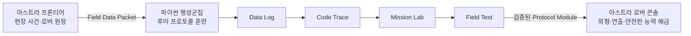
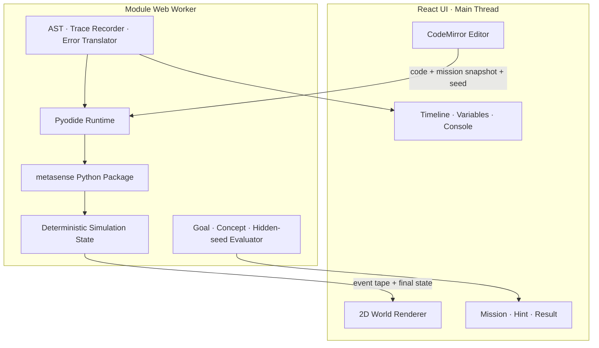

# 루미 프로토콜: 메타센스 Python World 교육과정·게임·개발 설계

> **상태: 장기 참고/Legacy 설계.** 2026-08-22 이후 초급 진입 순서, Vertical Slice, Beginner API, 이벤트 계약과 구현 우선순위는 [`docs/lumi-protocol/README.md`](./lumi-protocol/README.md) 및 그 하위 명세가 우선한다. 이 문서의 `for` 중심 첫 Vertical Slice와 코어 32모듈 고정안은 더 이상 현재 구현 기준이 아니다.

작성일: 2026-08-10  
대상: 메타센스 파이썬 행성군집  
권장 제품명: **루미 프로토콜 (LUMI Protocol)**  
권장 기능명: **MISSION LAB**  
권장 설명문: **Python으로 루미 로버의 항법·판단·탐사 능력을 복원하는 코딩 월드**

---

## 0. 최종 제안

새 프로그램을 별개의 코딩 게임이나 Turtle 대체물로 만들지 않는다.

메타센스의 현재 학습 구조에 다음 한 단계를 추가한다.

> **Transmission(선택) → Data Log → Code Trace → Mission Lab → Workbook(해당 단원) → Field Test(Quiz)**

여기서 세 가지 순서는 절대 바꾸지 않는다.

1. `Data Log`에서 개념을 이해한다.
2. `Code Trace`에서 정확한 문법과 패턴을 손으로 익힌다.
3. `Field Test`에서 개념 이해와 전이를 검증한다.

`Mission Lab`은 Code Trace와 Field Test 사이에 들어가는 **적용·관찰·디버깅의 다리**다. 학생은 정답 코드를 따라 쓰는 데서 멈추지 않고, 자신이 쓴 Python이 실제 세계를 바꾸는 것을 확인한다.

제품의 장기 정체성은 다음 한 문장으로 정의한다.

> **처음에는 한 줄씩 움직이던 같은 루미 로버가, 과정이 끝날 때에는 스스로 관찰하고 판단하고 탐사하는 자율 로버로 성장한다.**

이 구조는 CodeCombat의 짧고 명확한 미션형 학습, The Farmer Was Replaced의 자동화·최적화 재미, 메타센스의 지속적인 우주 세계·학습 기록·아스트라 프론티어를 결합한다.

---

## 1. 현재 메타센스 구조에 대한 판단

현재 코드베이스에는 새 기능을 처음부터 별도 플랫폼으로 만들 필요가 없을 만큼 많은 기반이 있다.

| 현재 자산 | 현 상태 | 루미 프로토콜에서의 역할 |
| --- | --- | --- |
| 파이썬 행성군집 | 입문·심화·수학/데이터·프로젝트 계열 행성 | 장기 커리큘럼 지도 |
| `MissionHub` | Python에서 Transmission → Data Log → Code Trace → Workbook → Field Test 순서 | Mission Lab 진입점 추가 |
| `CodeTracePlayer` | CodeMirror 6, Python 구문 강조, 단계별 입력, 진도·보상 저장 | 에디터 UX와 문법 훈련 자산 재사용 |
| `SpaceQuizView` | 퀴즈, 오답 지원, Data Log/영상 재참조 | Mission Lab 뒤 독립 전이 평가 |
| 학습 진도 집계 | quiz, video, text, workbook, codeTrace 5개 모달리티 | `missionLab` 모달리티 확장 |
| 아스트라 프론티어 | 루미 로버, 장거리 원정, 기억망, 시설, 일일 사건, 친구 행성 | 세계관과 장기 성장의 현장 층 |
| 아스트라 빌더 | 보호된 부지, 블록·모듈, 서버 저장 | 고급 Project Mode의 결과 전시 후보 |
| 광석·배지·연속학습 | 기존 경제와 성취 체계 | 새 화폐 없이 보조 보상 연결 |
| 교사·관리자 도구 | 콘텐츠, 퀴즈, Code Trace 편집 | Mission Lab 저작·검수 도구 확장 |

### 1.1 반드시 지킬 호환 원칙

- 기존 `units`, `codeExercises`, `quizzes`, `learning_progress`를 폐기하거나 대규모 이전하지 않는다.
- Mission Lab은 단원에 선택적으로 붙는 새 콘텐츠 타입으로 시작한다.
- Mission Lab이 나중에 추가되었다고 이미 완료한 단원·챕터가 미완료로 되돌아가면 안 된다.
- 기존 광석 경제를 흔드는 반복 보상을 추가하지 않는다.
- 아스트라 프론티어의 영구 월드에서 학생의 임의 Python 코드를 직접 실행하지 않는다.
- 새 런타임은 `MissionHub` 안에서 지연 로드하여 일반 수학 학습의 초기 로딩을 무겁게 만들지 않는다.

---

## 2. 제품·세계관 설계

### 2.1 핵심 서사

아스트라의 기억 폭풍으로 루미 로버의 자율 탐사 프로토콜이 손상되었다. 파이썬 행성군집에는 과거 탐사에서 수집된 환경 스냅숏이 남아 있다. 학생은 각 단원에서 다음 네 증거를 모아 하나의 프로토콜 모듈을 복원한다.

| 학습 단계 | 세계관 의미 | 학습 기능 |
| --- | --- | --- |
| Data Log | 과거 탐사 기록 해독 | 개념 이해 |
| Code Trace | 손상된 명령 패턴 복원 | 문법·패턴 정확성 |
| Mission Lab | 시뮬레이션에서 프로토콜 시험 | 적용·디버깅·실행 모델 |
| Field Test | 본부 검증 | 개념 전이·회상 |

네 단계는 별도 화폐를 주지 않는다. 완료 표시인 **지식 칩·구문 회로·실행 신호·검증 인장**이 조립되어 하나의 `Protocol Module`이 된다.

예:

- 이동 프로토콜
- 좌표 프로토콜
- 판단 프로토콜
- 반복 자동화 프로토콜
- 센서 데이터 프로토콜
- 함수 모듈
- 객체 설계 모듈
- 이벤트 제어 모듈

### 2.2 아스트라 프론티어와의 연결

두 제품은 세계관과 성장 결과를 공유하되 실행 엔진은 분리한다.



아스트라에 반영할 수 있는 것은 서버가 승인한 제한된 결과뿐이다.

- 로버 외형의 회로 발광, 안테나, 배지, 항법 궤적
- 로버 관제 화면의 프로토콜 레벨
- 새로운 원정 보고서 연출이나 정보 표시
- 아스트라 빌더용 장식·블루프린트 해금
- 과정 종합 프로젝트의 전시 링크

반영하지 않을 것:

- 학생 코드를 아스트라 공유 월드에서 직접 실행
- Python 코드로 광석·재료·시설 상태를 임의 변경
- 학습 미완료가 아스트라 기본 플레이를 막는 강제 게이트
- 빠른 실행·짧은 코드만을 공개 랭킹으로 경쟁

---

## 3. CodeCombat 성공요인 벤치마크

CodeCombat의 성공은 캐릭터 이동 API 하나가 아니라, 학습·게임·교실 운영을 동시에 설계한 데서 나온다. 메타센스는 다음 요소를 구조적으로 벤치마킹해야 한다.

CodeCombat은 공식 About 페이지에서 CodeCombat과 Ozaria 합산 누적 플레이어 2천만 명 이상, 190개국 이상, 작성 코드 10억 줄 이상을 제시한다. 이는 학습효과의 인과 증명은 아니지만, `실제 코드를 타이핑해 게임을 진행한다`는 진입 방식이 매우 큰 규모에서 작동해 왔다는 제품 검증 신호다. 별도의 McREL 보고서는 2018년 당시 사용자 중 교사 170명을 대상으로 구현 방식과 교사가 인식한 참여·학습 효과를 조사한 기술 연구이므로, 긍정적 결과를 참고하되 실험 연구처럼 과장해서는 안 된다.

### 3.1 가져와야 할 요소

| 성공요인 | CodeCombat에서의 역할 | 메타센스 적용 |
| --- | --- | --- |
| 실제 타이핑 코드 | 블록을 거치지 않고 Python/JavaScript 작성 | 처음부터 실제 Python 문법 사용 |
| 즉시 세계 반응 | Run 후 캐릭터 행동으로 결과 확인 | 루미 로버·센서·기지의 즉시 변화 |
| 한 레벨 한 목표 | 인지 부하가 작은 명확한 승리 조건 | 한 Mission Lab은 핵심 개념 1개, 보조 개념 최대 1개 |
| 반복 실행 비용 0 | 실패를 실험으로 바꿈 | Run·Reset 무제한, 실패 광석 차감 금지 |
| Starter Code | 빈 화면 공포 감소 | 초기 설정은 제공하되 항상 펼쳐 볼 수 있게 함 |
| Methods/API 패널 | 지금 쓸 수 있는 명령을 가까이 제시 | 교육과정 기반 API 자동완성·예제·잠금 표시 |
| 단계형 힌트 | 막힘을 이탈로 만들지 않음 | 관찰 → 개념 → 구조 → 부분 코드 순서 |
| 적응형 연습 | 막힌 학생에게 같은 개념의 추가 기회 | 오류 패턴별 `Calibration Mission` 자동 추천 |
| Challenge/Combo | 배운 개념을 조합해 전이 평가 | 단원 끝 Field Test와 섹터 끝 복합 Mission |
| 맵과 캐릭터 성장 | 다음 목표와 장기 진행을 시각화 | 행성 지도와 같은 루미 로버의 장기 성장 |
| 프로젝트·아레나 | 과정 끝 창작과 공유 | Project Bay, 전시, 제한적 Remix |
| 교사 대시보드 | 진도·시간·학생 코드 확인 | 코드 결과뿐 아니라 오류 회복 과정까지 제공 |
| 솔루션·수업 자료 | 비전공 교사도 운영 가능 | 정답 1개가 아닌 대표 풀이군·오개념·질문 카드 제공 |
| 레벨 저작 체계 | 많은 콘텐츠를 일정 품질로 확장 | 템플릿·검증기·버전·퍼블리시가 있는 Mission Editor |

### 3.2 그대로 복제하지 않을 요소

| 피할 점 | 이유 | 메타센스 대안 |
| --- | --- | --- |
| 장비가 API 사용 가능 여부를 좌우 | 문법 학습과 아이템 경제가 섞여 불필요한 인지 부하 발생 | API는 교육과정 마스터리로 해금 |
| 레벨마다 버려지는 캐릭터 상태·코드 | 학습이 개별 퍼즐 기억으로 분절될 수 있음 | 같은 루미와 기지, 누적 Protocol Notebook 유지 |
| 게임 안에서만 유효한 Python 유사 환경 | 실제 Python 생태계로의 전이가 약해질 수 있음 | Pyodide 기반 실제 Python과 표준 라이브러리 출구 |
| 완료 여부 중심 교사 데이터 | 왜 막혔고 어떻게 회복했는지 보기 어려움 | 실행·오류·힌트·수정·전이 평가를 연결 |
| 데스크톱 중심 UX | 현재 공식 교사용 안내도 태블릿 미지원으로 안내 | 태블릿을 1급 대상 기기로 설계 |
| 보상·장비가 핵심 동기 | 코딩보다 파밍이 목적이 될 위험 | 성장 증거는 로버 능력·작품·마스터리에 집중 |
| 정답에 가까워지는 힌트 | 복사 통과가 생길 수 있음 | 다음 사고를 묻는 힌트와 실행 증거 우선 |
| 무거운 초기 로딩 | 교실 네트워크에서 진입 실패 가능 | 단원 선택 뒤 프리로드, 런타임 캐시, Lite World |

### 3.3 CodeCombat보다 메타센스가 강할 수 있는 지점

1. **이해 → 따라쓰기 → 실행 → 퀴즈의 완결 루프**가 이미 있다.
2. **같은 루미 로버가 입문부터 클래스·데이터 분석까지 성장**한다.
3. **Code Trace와 Step 실행을 연결**하여 코드의 내부 실행을 눈으로 볼 수 있다.
4. Python을 수학·데이터·시각화와 연결해 게임 밖 실제 용도로 나간다.
5. 아스트라 프론티어, 아고라, 오답노트, 기록소가 하나의 학습 세계를 이룬다.
6. 학생 결과뿐 아니라 오류 회복 과정까지 교사에게 보여 줄 수 있다.
7. 한국어 오류 번역과 실제 Python 오류 원문을 동시에 제공할 수 있다.
8. 태블릿용 들여쓰기·기호 바와 작은 화면 전용 구조를 처음부터 설계할 수 있다.

### 3.4 The Farmer Was Replaced에서 가져올 요소

- 같은 공간을 계속 개선하는 지속성
- 반복 노동을 코드 한 번으로 자동화하는 쾌감
- 단순 통과 이후 더 안정적·일반적·효율적인 풀이로 개선하는 2차 목표
- 자원과 능력 해금이 더 강한 자동화를 가능하게 하는 성장 루프
- 코드가 실행되는 동안 결과를 관찰하는 재미

단, 메타센스는 Python과 유사한 전용 언어가 아니라 실제 Python을 쓰고, 자유 자동화 전에 명시적인 Data Log·Code Trace·Field Test를 제공한다.

---

## 4. 한 단원의 표준 학습 루프

### 4.1 권장 순서

1. **Transmission — 임무 브리핑**
   - 교사가 등록한 영상이 있을 때만 표시한다.
   - 오늘 복원할 프로토콜과 현장 문제를 보여 준다.

2. **Data Log — 개념 이해**
   - 개념, 실행 순서, 예제, 흔한 오개념을 설명한다.
   - 기존 완료·보상 로직을 유지한다.

3. **Code Trace — 정확한 패턴 습득**
   - 핵심 코드 2~4개를 직접 따라 쓴다.
   - 마지막 Trace는 Mission Lab의 starter code와 직접 연결한다.

4. **Mission Lab — 적용과 디버깅**
   - 세계를 관찰하고 코드를 실행하고 실패 원인을 고친다.
   - 정답 문자열이 아니라 결과 상태와 핵심 개념 사용을 평가한다.

5. **Workbook — 보조 표상 전환**
   - 파이썬 수학·데이터 단원처럼 별도 캔버스 활동이 있을 때만 둔다.

6. **Field Test — 독립 검증**
   - 게임 장면을 그대로 외우지 않아도 풀 수 있는 개념·추론 문제로 구성한다.
   - 오답 시 기존 Data Link로 Data Log/Transmission을 다시 볼 수 있다.

### 4.2 초기에는 권장 순서, 이후에는 선택적 게이트

베타에서는 기존 자유 탐색을 존중하여 카드를 강제로 잠그지 않는다. 대신 `권장 다음 단계`를 강조한다.

파일럿 데이터가 안정된 뒤 다음 정책을 검토한다.

- Mission Lab Core 1개 완료 전 Field Test에 경고 표시
- 차단 대신 “시뮬레이션을 먼저 완료하면 더 잘 풀 수 있어요” 안내
- 교사 설정으로 `자유형 / 권장형 / 순차형` 선택
- 이미 완료한 학생에게는 새 게이트를 소급 적용하지 않음

### 4.3 한 Mission Lab의 8단계

```text
1. BRIEF      20~40초  목표와 제약 확인
2. OBSERVE    10~20초  월드 상태 관찰
3. PREDICT    10초     실행 결과를 짧게 예측
4. CODE       2~6분    코드 작성·수정
5. RUN/STEP   반복     실행 결과와 현재 줄 관찰
6. DIAGNOSE   반복     오류·변수·월드 상태 비교
7. VERIFY     10~30초  공개·숨은 조건 검증
8. DEBRIEF    20초     배운 패턴과 다음 단계 기록
```

학생이 실제로 머무는 핵심 루프는 `CODE → RUN/STEP → DIAGNOSE`다. 이 반복에 비용이나 실패 페널티를 두지 않는다.

### 4.4 단원당 미션 구성

| 미션 | 시간 | 역할 | 필수 여부 |
| --- | ---: | --- | --- |
| Calibration | 2~4분 | 새로운 API와 개념을 한 번 성공 | 필수 |
| Core Mission | 6~10분 | 단원 목표를 실제 문제에 적용 | 필수 |
| Frontier Challenge | 4~8분 | 새로운 맵·데이터·숨은 조건으로 전이 | 선택 |

한 단원에 미션을 5~10개 넣어 플레이 시간을 늘리지 않는다. 핵심 2개와 선택 1개가 기준이다.

---

## 5. 핵심 게임 시스템

### 5.1 지속 성장하는 같은 루미

초급에서는 학생이 루미를 직접 움직인다.

```python
lumi.move(3)
lumi.turn(90)
```

중급에서는 반복과 판단을 준다.

```python
for step in range(5):
    lumi.move(1)

if lumi.energy < 30:
    lumi.charge()
```

심화에서는 센서 데이터를 처리한다.

```python
objects = lumi.scan()

for obj in objects:
    if obj.kind == "signal":
        lumi.collect(obj)
```

고급에서는 학생이 새로운 로버 클래스를 설계한다.

```python
class RescueRover(Rover):
    def rescue(self):
        for signal in self.scan():
            if signal.priority >= 3:
                self.navigate_to(signal.position)
```

### 5.2 API 설계 원칙

MVP 객체는 다섯 개로 제한한다.

| 객체 | 역할 | 초기 API |
| --- | --- | --- |
| `lumi` / `Rover` | 학생의 지속 캐릭터 | `move`, `turn`, `say`, `scan`, `collect`, `charge` |
| `world` / `World` | 환경과 규칙 | `time`, `weather`, `objects`, `get_tile` |
| `Signal` | 탐사 목표 | `kind`, `strength`, `position`, `priority` |
| `Sample` | 수집·분석 데이터 | `kind`, `value`, `position` |
| `Base` | 저장·건설·자동화 | `store`, `build`, `status` |

원칙:

- 학생 코드에는 초급부터 `async/await`를 노출하지 않는다.
- `from metasense import *`보다 명시적 import로 실제 Python 습관을 만든다.
- 처음에는 설정 코드를 제공하되 숨기지 않고 펼쳐 볼 수 있게 한다.
- API 해금은 구매가 아니라 학습 개념 해금이다.
- 나중에 `math`, `random`, `statistics`, `numpy`, `pandas`, `matplotlib`로 빠져나간다.
- 메타센스 API에만 갇히지 않는 것이 졸업 조건이다.

### 5.3 미션 문법 7종

많은 콘텐츠를 만들더라도 게임 규칙을 무한히 늘리지 않는다. 다음 일곱 템플릿을 조합한다.

1. **Navigate**: 목표 위치까지 이동
2. **Collect**: 조건에 맞는 대상 수집
3. **Avoid**: 장애물·위험·에너지 조건 처리
4. **Repair**: 잘못된 코드를 실행하고 수정
5. **Decode**: 문자열·리스트·딕셔너리 데이터 해석
6. **Automate**: 반복 작업을 함수·루프로 자동화
7. **Create**: 이벤트와 객체로 작은 게임·시뮬레이션 제작

### 5.4 성공 판정

코드 문자열 일치로 채점하지 않는다.

세 층을 분리한다.

1. **World Goal**: 최종 상태가 목표를 달성했는가
2. **Concept Evidence**: 이번 단원의 개념을 실제로 사용했는가
3. **Robustness**: 다른 시작 상태·seed에서도 작동하는가

예:

```json
{
  "goal": {
    "allSignalsCollected": true,
    "minimumEnergy": 20
  },
  "conceptEvidence": {
    "mustUseAny": ["for", "while"],
    "mustCall": ["lumi.scan"]
  },
  "robustness": {
    "hiddenSeeds": [17, 29]
  }
}
```

학생에게는 세 개의 인장으로 보여 준다.

- 1성: 임무 성공
- 2성: 목표 개념 사용
- 3성: 새로운 상황에서도 성공

초급 과정에서는 코드 길이·실행 속도를 필수 점수로 삼지 않는다. 최적화는 심화의 선택 목표다.

### 5.5 실패·오류 피드백

실패는 다음 네 층으로 설명한다.

1. **월드 증거**: “루미가 신호 앞 두 칸에서 멈췄어요.”
2. **실행 증거**: 마지막 실행 줄, 변수 값, 명령 타임라인
3. **교육용 번역**: “for 문 끝의 `:`를 확인해 보세요.”
4. **실제 Python 원문**: `SyntaxError: expected ':'`

실제 오류를 숨기지 않고, 처음에는 번역을 앞에 둔다. 과정 후반에는 실제 오류를 먼저 읽도록 설정을 전환한다.

### 5.6 힌트 사다리

| 단계 | 내용 | 예 |
| --- | --- | --- |
| 1 관찰 | 월드에서 놓친 사실 | “같은 이동이 다섯 번 반복되고 있어요.” |
| 2 개념 | 사용할 개념 이름 | “반복문을 사용할 수 있어요.” |
| 3 구조 | 코드 골격 | `for i in range(...):` |
| 4 부분 코드 | 빈칸이 있는 핵심 코드 | `for i in range(□):` |
| 5 해설 | 대표 풀이와 실행 설명 | 완료 후 또는 교사 승인 |

힌트를 사용해도 완료는 가능하다. 다만 교사 화면에서 `독립 해결 / 도움 후 해결`을 구분한다. 힌트 사용에 광석 벌금을 부과하지 않는다.

---

## 6. 새 Python 교육과정

기존 Firestore 행성·챕터·단원을 한 번에 교체하지 않는다. 아래는 Mission Lab을 붙일 **코어 32모듈**이며, 현재 Data Log/PDF/Code Trace 단원과 매핑해 점진적으로 도입한다.

### 6.1 Planet I — 처음 파이썬: 항법 기초

목표: 한 줄의 코드가 순서대로 상태를 바꾼다는 것을 이해한다.

| 모듈 | Python 개념 | 대표 미션 | 해금 |
| --- | --- | --- | --- |
| 1. 첫 교신 | 함수 호출, 순차 실행 | 루미를 비콘까지 이동 | `move`, `say` |
| 2. 방향과 좌표 | 인자, 숫자 | 회전 후 착륙점 진입 | `turn`, `x`, `y` |
| 3. 탐사 값 저장 | 변수, 할당 | 이동 거리 저장·재사용 | 로버 상태 HUD |
| 4. 교신 메시지 | 문자열, `print` | 손상된 호출부호 복원 | 메시지 패널 |
| 5. 입력 변환 | `input`, `int`, 형변환 | 관제 입력으로 이동량 결정 | 콘솔 입력 |
| 6. 신호 조각 | 인덱스, 슬라이싱 | 좌표 문자열에서 구역 코드 추출 | 데이터 디코더 |
| 7. 메서드와 상태 | 객체·속성의 직관 | 에너지와 위치를 읽고 행동 | 상태 Inspector |

섹터 종합: **귀환등 복원** — 변수·문자열·이동 명령을 조합한다.

### 6.2 Planet II — 파이썬 심화: 판단과 자동화

목표: 환경을 읽고 반복 가능한 규칙을 만든다.

| 모듈 | Python 개념 | 대표 미션 | 해금 |
| --- | --- | --- | --- |
| 8. 위험 판독 | 비교, Boolean | 안전 타일 판별 | `world.get_tile` |
| 9. 에너지 판단 | `if` | 에너지 부족 시 충전 | `charge` |
| 10. 다중 항로 | `elif`, `else` | 신호 세기에 따른 경로 선택 | 경로 센서 |
| 11. 순찰 루프 | `for`, `range` | 같은 구역 반복 순찰 | 자동 항법 |
| 12. 탐사 그리드 | 중첩 반복 | 2차원 구역 스캔 | Grid Scan |
| 13. 구조 신호 대기 | `while` | 신호를 찾을 때까지 탐사 | 지속 센서 |
| 14. 비상 탈출 | `break`, `continue` | 위험 표본 건너뛰기 | 안전 규칙 |

섹터 종합: **폭풍 너머의 항로** — 고정 좌표가 달라져도 작동하는 구조 신호 회수 코드.

### 6.3 Planet III — 파이썬 수학·데이터: 관측 분석국

목표: 센서·인벤토리·관측 데이터를 구조화하고 분석한다.

| 모듈 | Python 개념 | 대표 미션 | 해금 |
| --- | --- | --- | --- |
| 15. 표본 보관함 | 리스트, append, sum | 표본 가치 합산 | `inventory` |
| 16. 상태 사전 | dict | 로버 상태표 갱신 | `status` |
| 17. 중복 신호 제거 | set, tuple | 고유 신호만 보존 | 신호 도감 |
| 18. 좌표 결합 | `zip`, unpacking | x·y 관측값 결합 | 좌표 패킷 |
| 19. 탐사 함수 | `def`, 매개변수 | 경로 행동을 함수화 | 함수 슬롯 |
| 20. 분석 결과 | `return`, scope | 표본 평균 반환 | 분석 콘솔 |
| 21. 수학 항법 | `math`, 소수·약수·최대공약수 | 통신 주기 계산 | 수학 코어 |
| 22. 배열 관측 | NumPy 1D/2D | 온도 격자 이상치 탐지 | 센서 배열 |
| 23. 관측 기록표 | pandas Series/DataFrame | 원정 로그 필터·집계 | Data Station |
| 24. 별지도 시각화 | matplotlib | 좌표·빈도 그래프 생성 | 관측 차트 |

섹터 종합: **아스트라 기억망 분석** — 여러 원정 기록에서 폭풍 이전 패턴을 찾아 시각화한다.

### 6.4 Planet IV — 게임 프로젝트: 자율 시스템 조선소

목표: 여러 개념을 구조화하여 자신의 프로그램과 게임을 만든다.

| 모듈 | Python 개념 | 대표 미션 | 해금 |
| --- | --- | --- | --- |
| 25. 로버 설계도 | class, object | 나만의 로버 생성 | `Rover` 클래스 |
| 26. 초기 상태 | `__init__`, `self` | 이름·에너지·도구 설정 | 로버 커스텀 |
| 27. 전문 로버 | 상속, override | 구조·채굴 로버 분화 | 로버 타입 |
| 28. 이벤트 제어 | 키·충돌·타이머 이벤트 | 보물찾기 게임 | Event API |
| 29. 게임 규칙 | 점수·생명·상태 전이 | 위험 구역 게임 | Rule Engine |
| 30. 모듈 분리 | import, 다중 파일 | player/items/world 분리 | Project files |
| 31. 테스트 항로 | 예외, 테스트, 디버깅 | 잘못된 입력과 경계값 방어 | Test Console |
| 32. 캡스톤 | 설계·제작·설명·공유 | 나만의 아스트라 원정 | Project Bay |

코어는 32모듈로 운영하되, 기존 단원 중 유사 개념은 하나의 Mission Lab 세트로 묶을 수 있다. 모든 기존 PDF 단원에 억지로 독립 월드를 만들지 않는다.

---

## 7. 화면·조작 설계

### 7.1 데스크톱

월드가 가장 커야 한다.

```text
┌─────────────────────────────────────────────────────────────┐
│ LUMI PROTOCOL · Mission 11     목표 2/3     API  RUN  STEP   │
├───────────────┬───────────────────────────┬─────────────────┤
│ MISSION       │ WORLD                     │ PYTHON          │
│ 목표          │                           │ code editor     │
│ 제약          │       LUMI → signal       │                 │
│ API           │                           │                 │
│ 힌트          │                           │                 │
├───────────────┴───────────────────────────┴─────────────────┤
│ Timeline | Variables | Console | Test results               │
└─────────────────────────────────────────────────────────────┘
```

권장 비율:

- 월드 46~52%
- 코드 30~36%
- 미션 16~20%
- 하단 Trace 20~28% 높이, 접기 가능

### 7.2 태블릿

태블릿은 CodeCombat 대비 메타센스의 전략적 차별점이다.

- 상단 탭: `WORLD / CODE / MISSION`
- Code 탭에서도 상단 30~35%에 작은 World Preview 유지
- 하단 고정 키 바: `Tab`, `Shift Tab`, `:`, `()`, `[]`, `{}`, `""`, `=`, `_`
- API 카드는 탭하면 코드 삽입이 아니라 예제·설명을 먼저 표시
- 세로 모드는 코드 중심, 가로 모드는 2분할
- 한 손가락은 편집, 두 손가락은 월드 카메라로 충돌을 피함

### 7.3 스마트폰

스마트폰은 Core Mission의 본격 작성보다 다음 범위를 우선한다.

- Data Log·Code Trace·실행 결과 보기
- 짧은 Calibration Mission
- 빈칸 수정, 값 변경, 오류 한 줄 고치기
- 기존 코드 실행·Step·힌트·복습

다중 파일 Project Mode는 PC·태블릿 권장으로 표시한다.

### 7.4 접근성

- 색만으로 성공·실패를 구분하지 않고 아이콘·텍스트·소리를 함께 사용
- 애니메이션 감소 설정
- 실행 속도 0.5×, 1×, 2×
- 효과음·배경음·음성 분리
- 키보드만으로 모든 주요 동작 가능
- Inspector와 오류 메시지 스크린리더 레이블 제공
- 한글 IME 조합 중 자동완성·린트가 입력을 방해하지 않도록 지연

---

## 8. 실행·Step·렌더링 아키텍처

### 8.1 권장 구조



원칙:

- Python은 DOM이나 2D/3D 그래픽을 직접 그리지 않는다.
- Worker 안에서 결정론적 시뮬레이션을 실행한다.
- 메인 스레드는 이벤트 테이프를 재생하고 UI만 담당한다.
- World Renderer는 학습 로직의 진실 원천이 아니다.
- Mission은 초기 상태와 seed가 고정되어 다시 실행할 수 있다.

### 8.2 Step 실행은 기록 후 재생으로 시작

MVP에서 버튼을 누를 때마다 Python 인터프리터를 진짜 일시정지시키는 복잡한 디버거를 먼저 만들지 않는다.

1. Worker에서 제한된 전체 실행을 수행한다.
2. `line`, `call`, `return`, `world_command`, `variable_snapshot` 이벤트를 기록한다.
3. 실행이 끝나면 이벤트 테이프를 Step 버튼으로 한 장면씩 재생한다.
4. 실행 오류가 나면 오류 직전까지의 테이프를 재생한다.

이 방식은 `for`, 함수 호출, 변수 변화와 월드 행동을 안정적으로 동기화한다. 실시간 대화형 디버거는 Project Mode 이후로 미룬다.

### 8.3 Stop과 무한루프

MVP의 `STOP`은 Worker를 종료하고 새 Worker를 만드는 hard stop으로 구현한다.

이유:

- Pyodide의 graceful interrupt는 Web Worker와 `SharedArrayBuffer` 및 보안 헤더 구성이 필요하다.
- 현재 메타센스는 YouTube·PDF·외부 리소스를 함께 사용하므로 전체 사이트에 교차 출처 격리 헤더를 성급하게 적용하면 기존 콘텐츠가 깨질 수 있다.
- Mission Mode는 실행 환경이 일회성이므로 Worker 재생성이 단순하고 안전하다.

추가 제한:

- 최대 실행 시간
- 최대 World command 수
- 최대 출력 글자 수
- 최대 Trace event 수
- 미션별 허용 import 목록
- 네트워크·DOM·Firebase credential 미노출
- 실행마다 임시 파일시스템 초기화

Worker의 결과는 보상 보안 관점에서 신뢰하지 않는다. Worker 안에는 비밀키를 넣지 않는다.

### 8.4 2D 우선, 3D 연계는 나중

MVP는 Canvas 기반 2D 또는 가벼운 2.5D 타일 월드가 적합하다.

- 로딩이 빠르다.
- 좌표·반복·리스트를 눈으로 읽기 쉽다.
- 태블릿에서 안정적이다.
- 동일한 이벤트 계약으로 나중에 3D Renderer를 붙일 수 있다.

아스트라 프론티어의 3D 장면을 Mission Lab에 직접 넣지 않는다. 색·소리·로버·오브젝트 카탈로그와 세계관만 공유한다.

### 8.5 현재 저장소 기준 변경 지도

권장 신규 구조:

```text
src/
├─ components/
│  └─ PythonWorld/
│     ├─ PythonMissionLab.jsx
│     ├─ PythonMissionLab.css
│     ├─ MissionPanel.jsx
│     ├─ PythonWorldCanvas.jsx
│     ├─ PythonEditor.jsx
│     ├─ RunControls.jsx
│     ├─ TraceTimeline.jsx
│     ├─ VariableInspector.jsx
│     ├─ PythonConsole.jsx
│     ├─ MissionResult.jsx
│     ├─ runtime/
│     │  ├─ pythonWorld.worker.mjs
│     │  ├─ PythonRuntimeClient.js
│     │  ├─ eventTape.js
│     │  └─ errorTranslator.ko.js
│     ├─ simulation/
│     │  ├─ missionState.js
│     │  ├─ worldEvents.js
│     │  └─ worldRenderer.js
│     └─ assessment/
│        ├─ missionEvaluator.js
│        ├─ conceptEvidence.js
│        └─ missionLimits.js
├─ hooks/
│  ├─ usePythonMissionSet.js
│  └─ usePythonMissionProgress.js
├─ pages/Admin/
│  ├─ PythonMissionEditor.jsx
│  └─ PythonMissionPreview.jsx
└─ utils/
   ├─ pythonMissionSchema.js
   └─ pythonMissionProgressUtils.js

public/
├─ pyodide/<pinned-version>/
└─ python-world/
   ├─ sprites/
   ├─ maps/
   └─ metasense/

scripts/
├─ test-python-mission-schema.mjs
├─ test-python-mission-evaluator.mjs
├─ test-python-mission-progress.mjs
└─ validate-python-mission-catalog.mjs
```

기존 파일 변경:

| 파일 | 변경 |
| --- | --- |
| `src/components/Space/MissionHub.jsx` | Python 전용 카드 순서에 `mission` 추가, `PythonMissionLab` lazy render |
| `src/components/Space/SpaceHome.jsx` | `missionLab` 모달리티 집계와 완료 정책 적용 |
| `src/hooks/useContent.js` | 단원별 Mission Set 조회·관리 mutation 추가 |
| `src/hooks/useLearningHistory.js` | `python_mission` 학습 기록 정규화 |
| `src/utils/learningSummaryUtils.js` | 교사·과제 요약에 Mission Lab 증거 추가 |
| `src/components/Space/DailyLearningTimeline.jsx` | 오늘의 Mission Lab 진행·완료 표시 |
| `src/pages/Admin/ContentManager.jsx` | Mission Lab 편집 진입점 추가 |
| `firestore.rules` | 공개된 미션 읽기, 자기 초안 쓰기, 보상·발행 권한 분리 |
| `firestore.indexes.json` | `unitId + status + order` 조회 인덱스 |
| `firebase.json` | Pyodide 정적 파일 캐시 정책. 전역 COOP/COEP는 적용하지 않음 |
| `package.json` | 고정된 Pyodide 버전과 Mission 검증 스크립트 추가 |

이미 설치된 CodeMirror 패키지를 재사용한다. Pyodide는 `latest` CDN 주소를 사용하지 않고 버전을 고정한다. 교실 네트워크와 장기 재현성을 위해 운영 단계에서는 필요한 런타임·wheel을 자체 Hosting 경로에서 제공하는 방안을 우선 검토한다.

### 8.6 테스트 전략

1. **순수 로직 테스트**
   - 동일 seed의 이벤트 테이프가 항상 동일
   - 이동·충돌·에너지·수집 규칙
   - 공개·숨은 목표와 AST 증거 판정

2. **Worker 계약 테스트**
   - load, run, stop, reset, timeout, recycle
   - stdout/stderr 제한
   - 무한루프·과도한 출력·금지 import

3. **진도 회귀 테스트**
   - Mission Lab 추가 전 완료 학생의 완료 유지
   - 미션 버전 업데이트 뒤 별·완료 보존
   - history와 learning_progress OR 보정

4. **콘텐츠 검증 테스트**
   - 대표 풀이·대체 풀이·의도된 오답
   - 모든 seed의 종료 시간과 명령 상한
   - API 해금 불일치 탐지

5. **브라우저 E2E**
   - PC Chrome/Safari/Firefox/Edge
   - iPad Safari, Android Chrome
   - 한글 IME, 하드웨어 키보드, 터치 키 바
   - 느린 네트워크, 오프라인 재진입, 탭 전환

6. **수업 관찰 QA**
   - 학생이 목표보다 연출만 보고 있는지
   - 두 학생이 같은 오류 문구를 다르게 이해하는지
   - 교사가 대시보드만 보고 다음 도움을 결정할 수 있는지

---

## 9. 데이터 모델

### 9.1 콘텐츠

```text
pythonMissionSets/{setId}
pythonWorldMissions/{missionId}
pythonWorldTemplates/{templateId}
```

Mission 문서 예:

```json
{
  "id": "py_loop_03_core",
  "unitId": "unit_py_loop_03",
  "setId": "set_py_loop_03",
  "status": "published",
  "version": 4,
  "runtimeVersion": "metasense-py-0.1",
  "title": "폭풍 속 신호 5개",
  "difficulty": "core",
  "estimatedMinutes": 8,
  "concepts": ["for", "range", "method_call"],
  "apiUnlocks": ["lumi.scan"],
  "worldTemplateId": "route_storm_grid_v2",
  "worldSeed": 17,
  "starterCode": "from metasense import lumi\n\n",
  "goals": [],
  "conceptEvidence": {},
  "hiddenSeeds": [29, 41],
  "hints": [],
  "limits": {
    "wallClockMs": 3000,
    "maxCommands": 200,
    "maxOutputChars": 5000,
    "maxTraceEvents": 2000
  },
  "publishedAt": "server timestamp"
}
```

### 9.2 학생 진행

요약 진도는 기존 경로와 결합한다.

```text
users/{uid}/learning_progress/{unitId}
```

```json
{
  "missionLab": {
    "setId": "set_py_loop_03",
    "setVersion": 4,
    "completed": true,
    "completedMissionIds": ["py_loop_03_cal", "py_loop_03_core"],
    "bestStars": 5,
    "independentClearCount": 1,
    "hintedClearCount": 1,
    "lastPlayedAt": "server timestamp"
  }
}
```

코드 초안과 상세 시도는 별도 문서로 둔다.

```text
users/{uid}/pythonMissionProgress/{missionId}
users/{uid}/pythonMissionProgress/{missionId}/runs/{runId}
```

기본 보존 원칙:

- 초안: 최신 1개
- 대표 성공 코드: 버전별 1개
- 실행 상세: 최근 20회 또는 30일
- 장기 통계: 코드 원문 없이 집계값만 보존
- 학생 프로젝트 공개는 명시적 선택과 교사 정책 적용

### 9.3 기존 진도와의 호환

`SpaceHome`의 모달리티 집계에 `missionLab`을 추가하되 다음 필드를 둔다.

```json
{
  "completionPolicy": {
    "version": 2,
    "requiredModalities": ["text", "codeTrace", "missionLab", "quiz"],
    "effectiveFrom": "server timestamp",
    "grandfatherExistingCompletions": true
  }
}
```

- 기존 완료자는 완료 유지
- 새 입학생·새 단원에만 새 정책 적용
- Mission Lab이 없는 단원은 현재 다섯 모달리티 계산 유지
- 미션 버전이 올라도 이미 획득한 완료·별은 보존
- 학습 목표가 바뀐 major version만 선택적 재도전 표시

---

## 10. 보상·성장·사회적 기능

### 10.1 보상 원칙

MVP에서는 Mission Lab 실행·재실행에 광석을 주지 않는다.

이유:

- 기존 Data Log, Code Trace, Quiz에 이미 광석 보상이 있다.
- 실행 횟수 보상은 무의미한 반복과 매크로를 유도한다.
- 브라우저 Worker 결과만으로 경제 보상을 주면 조작 위험이 있다.

Mission Lab의 1차 보상:

- Protocol Module 조립
- 루미 외형·HUD·애니메이션 변화
- Mission Notebook에 대표 코드 저장
- 배지와 프로젝트 소재 해금
- 선택 Challenge와 숨은 탐사 기록 해금

서버 검증 체계가 생긴 뒤에도 광석은 `Core Mission 최초 완료`에 작은 고정량만 검토한다. 재실행·최적화에는 광석 대신 별·기록·배지를 준다.

### 10.2 권장 배지

- **첫 신호**: 첫 Mission Lab 완료
- **침착한 디버거**: 오류 후 힌트 없이 성공
- **다른 항로, 같은 목적**: 대표 풀이와 다른 해법 성공
- **견고한 항법사**: 숨은 seed 3개 통과
- **자동화 설계자**: 반복문·함수 Challenge 완료
- **루미의 동료**: 4개 행성 코어 모듈 완료
- **프로토콜 아키텍트**: 캡스톤 공개·교사 승인

### 10.3 사회 기능

- 초급에서는 정답 코드 전체 공개·랭킹을 하지 않는다.
- 완료 후에만 다른 접근의 익명 요약을 보여 준다.
- Project Bay에서만 작품 공유·좋아요·Remix를 허용한다.
- Remix는 원작자 표시와 변경점 설명을 요구한다.
- 아고라 질문 생성 시 현재 코드 전체가 아니라 학생이 선택한 줄·오류·월드 스냅숏만 첨부한다.
- 친구 경쟁은 실행 속도보다 `개념 조합`, `견고성`, `창의적 프로젝트` 중심으로 한다.

---

## 11. 교사·관리자 경험

### 11.1 교사 화면

교사는 “완료/미완료”보다 다음 질문에 답을 얻어야 한다.

- 학생이 첫 실행까지 얼마나 걸렸는가?
- 어떤 오류에서 반복적으로 막혔는가?
- 힌트 어느 단계에서 해결했는가?
- 정답 코드를 복사했는가, 수정하며 도달했는가?
- 월드 목표는 달성했지만 개념 사용을 우회했는가?
- Field Test에서도 같은 개념을 이해했는가?

권장 학생 상태:

- 미시작
- 관찰 중
- 실행 시작
- 문법 오류 반복
- 논리 오류 반복
- 도움 후 해결
- 독립 해결
- 전이 확인
- Challenge 숙달

교사용 액션:

- 학생의 대표 코드와 마지막 실패 코드 비교
- 실행 타임라인 재생
- 교사 힌트 1회 전송
- Calibration Mission 배정
- 모범 풀이 2~3개 비교
- 코드 줄에 피드백 남기기
- 동일 오류 학생 그룹 보기

### 11.2 Mission Editor

저작 도구는 콘텐츠 확장의 핵심 제품이다.

필수 기능:

1. 단원·개념·난이도·예상 시간 지정
2. World Template과 seed 선택
3. 오브젝트 배치·초기 상태 편집
4. Starter Code와 학습자 편집 영역 설정
5. World Goal·AST Evidence·숨은 seed 설정
6. 단계형 힌트 작성
7. 대표 풀이 여러 개 등록
8. 잘못된 풀이·우회 풀이 테스트
9. PC·태블릿 미리보기
10. Draft → Review → Published → Archived 상태
11. 버전 비교·롤백
12. 배포 전 자동 검증

자동 검증:

- 대표 풀이가 모든 공개·숨은 조건을 통과
- Starter Code가 실행 가능하거나 의도된 오류만 포함
- 사용 API가 해당 모듈에서 해금됨
- 힌트가 정답 전체를 너무 일찍 노출하지 않음
- 목표가 여러 해법을 허용함
- 제한 시간·명령 수 안에서 종료
- 태블릿 화면에 목표·Run·Stop이 가려지지 않음

AI는 마지막 단계에서만 사용한다.

- 오류 군집 요약
- 힌트 초안 제안
- 변형 seed 제안
- 대표 풀이와 다른 우회 해법 탐색

AI가 미션의 정답 판정과 보상 지급의 유일한 근거가 되어서는 안 된다.

---

## 12. 개발 단계와 출시 기준

일정은 전담 인력 4~5명 기준의 범위 추정이며, 날짜보다 각 단계의 종료 조건을 우선한다.

### Phase 0 — 제품 계약과 콘텐츠 프로토타입 (2주)

산출물:

- 제품명·세계관·핵심 루프 확정
- `metasense` API v0.1 명세
- Mission JSON schema
- 6개 종이/클릭 프로토타입 미션
- 기존 단원 6개와 매핑
- 교사 2~3명 콘텐츠 리뷰

종료 조건:

- 첫 학생이 설명 없이 2분 안에 목표·Run·Reset을 이해
- 한 개념당 미션 목표가 하나로 읽힘
- Data Log → Code Trace → Mission Lab 연결이 설명 가능

### Phase 1 — Vertical Slice (4~6주)

범위:

- MissionHub에 feature flag 기반 Mission Lab 카드
- CodeMirror 재사용
- Pyodide module Worker 지연 로드
- 2D 한 맵, 루미, 벽, 비콘, 신호, 에너지
- `move`, `turn`, `say`
- Run, hard Stop, Reset, Console
- 결과 기반 판정
- 입문 6개 미션
- 초안·완료 진도 저장

종료 조건:

- 중급형 Chromebook/태블릿에서 반복 실행 안정
- 무한루프를 1초 안팎의 사용자 조작으로 중단
- 첫 의미 있는 월드 변화까지 중앙값 90초 이내
- 런타임 오류·빈 화면 비율 2% 미만

### Phase 2 — Learning Alpha (6~8주)

범위:

- `scan`, `collect`, `charge`
- if, for, while, function 미션
- AST 개념 판정
- Trace event tape와 Step 재생
- Variables Inspector
- 교육용 오류 번역
- 18~24개 미션
- Mission Editor 최소 기능
- 교사 진도·마지막 코드 보기

종료 조건:

- 여러 정답 풀이 통과
- 우회 풀이와 무한 출력 차단
- 교사가 개발자 도움 없이 미션 1개 복제·수정·발행
- Mission Lab 후 Field Test 성취가 비교군 대비 개선 경향

### Phase 3 — Classroom Beta (4~6주)

범위:

- 코어 30개 미션
- 태블릿 키 바·반응형 UI
- Calibration 추천
- 힌트 사다리
- 기존 진도 집계와 `missionLab` 통합
- completion policy·기존 완료 보호
- 오류·수정·힌트 학습 분석
- 교사 파일럿 가이드

종료 조건:

- 첫 6개 미션 독립 완료율 75% 이상
- 수업 중 교사 기술 개입 필요 학생 20% 미만
- 저장 유실 0.5% 미만
- 학생·교사가 기존 Code Trace와 Mission Lab의 역할을 구분

### Phase 4 — 지속 세계와 아스트라 연결 (6~8주)

범위:

- Protocol Module·같은 루미의 장기 성장
- 아스트라 로버 콘솔에 검증된 모듈 표시
- 외형·연출·블루프린트 해금
- Frontier Data Packet 테마 미션
- Mission Notebook
- 선택 Challenge와 배지

종료 조건:

- 학습 미완료가 아스트라 기본 플레이를 방해하지 않음
- 클라이언트 조작으로 경제·월드 상태를 변경할 수 없음
- 학생이 “이 단원에서 배운 코드가 루미에게 무엇을 가능하게 했는지” 설명 가능

### Phase 5 — Project Bay (8주 이상)

범위:

- 이벤트 API
- 자유 월드
- 다중 파일
- 표준 라이브러리
- 저장·버전·복구
- 작품 공유·Remix·교사 승인
- 아스트라 빌더 전시 연결

종료 조건:

- 학생이 메타센스 API 없이도 일부 프로젝트를 완성
- 프로젝트가 Python 파일로 내보내져 로컬 환경에서 이어질 수 있음
- 공유 전 개인정보·부적절 텍스트·악성 실행 검수

---

## 13. 측정 지표

### 13.1 학습 지표

- Data Log → Code Trace → Mission Lab → Field Test 완주율
- 첫 실행까지 시간
- 첫 성공까지 실행 횟수
- 문법 오류에서 정상 실행까지 회복 시간
- 논리 오류 수정 횟수
- 힌트 단계별 사용률
- 목표 성공과 개념 증거 성공의 차이
- 숨은 seed 통과율
- Mission Lab 전후 동일 개념 Quiz 정답률
- 2주 뒤 재도전 유지율
- 메타센스 API에서 표준 Python 문제로의 전이율

### 13.2 제품 지표

- Mission Lab 카드 진입률
- 런타임 초기 로드 시간 p50/p95
- Worker 비정상 종료율
- 저장·복구 성공률
- PC/태블릿/스마트폰별 완료율
- 미션별 이탈 지점
- 교사 개입률
- Mission Editor 발행 성공률과 검수 반려 원인
- 아스트라 모듈 확인·재방문율

### 13.3 잘못된 성공 지표

다음 수치만 높이는 최적화는 피한다.

- 실행 버튼 클릭 수
- 코드 줄 수
- 체류 시간
- 광석 획득량
- 힌트 미사용률
- 가장 짧은 코드

많이 실행하거나 오래 머문 것이 항상 좋은 학습은 아니다. 핵심은 **오류를 해석하고 수정하여 새로운 상황에 전이하는가**다.

---

## 14. 주요 위험과 대응

| 위험 | 결과 | 대응 |
| --- | --- | --- |
| Pyodide 초기 로딩이 큼 | 첫 진입 이탈 | 단원 진입 후 idle preload, 캐시, Lite World |
| true Step debugger를 먼저 개발 | 일정 지연·불안정 | event tape 재생으로 시작 |
| 새 모달리티 추가로 기존 완료 취소 | 신뢰 훼손 | policy version, effective date, grandfathering |
| 클라이언트 실행 결과로 광석 지급 | 조작·경제 인플레이션 | MVP 비경제 보상, 서버 검증 뒤 제한 보상 |
| 아스트라와 런타임 강결합 | 두 시스템 동시 장애 | 이벤트·해금 계약만 공유 |
| 모든 기존 단원에 게임을 억지 적용 | 저품질 반복 미션 | 코어 32모듈 우선, 관련 단원 묶기 |
| 게임 연출이 코드보다 큼 | 관람형 학습 | 90초 안에 첫 코드 실행, 짧은 연출 |
| 힌트가 답 복사로 끝남 | 거짓 완료 | 관찰·실행 증거 중심, 대표 풀이 지연 공개 |
| 자유 import·네트워크 접근 | 보안·개인정보 위험 | 허용 목록, Worker 격리, 비밀 미노출 |
| 태블릿 들여쓰기 실패 | 학습보다 입력 투쟁 | 키 바, 자동 들여쓰기, IME QA |
| 교사가 학생 오류를 설명하기 어려움 | 수업 운영 부담 | 오류 군집, 타임라인, 대표 오개념 가이드 |
| 저사양 기기에서 3D 성능 문제 | 기기별 학습 격차 | 2D 기본, 3D는 선택 Renderer |

---

## 15. 지금 확정할 의사결정

1. 제품명은 우선 **루미 프로토콜**, 기능명은 **MISSION LAB**으로 사용한다.
2. Mission Lab은 Code Trace와 Field Test 사이의 적용 단계다.
3. 처음부터 같은 루미 로버를 사용하고 과정 전체에 상태·외형·Notebook을 누적한다.
4. CodeCombat의 typed code·짧은 미션·즉시 피드백·힌트·교사 운영을 벤치마킹한다.
5. The Farmer Was Replaced의 지속 공간·자동화·최적화 재미를 심화 과정에 적용한다.
6. MVP는 2D, 실제 Python, CodeMirror, Pyodide Worker, 결과 기반 채점으로 시작한다.
7. Step은 전체 실행 중 기록한 이벤트 테이프를 한 단계씩 재생한다.
8. Mission Lab 실행 횟수에는 광석을 지급하지 않는다.
9. 아스트라에는 검증된 모듈·외형·블루프린트만 반영하고 임의 코드는 실행하지 않는다.
10. 기존 완료 기록은 새 콘텐츠 추가 뒤에도 보존한다.
11. 코어 32모듈·MVP 30미션을 먼저 만들고 모든 기존 단원을 일괄 변환하지 않는다.
12. 콘텐츠 저작·검수 도구를 학생 기능과 함께 개발한다.

---

## 16. 첫 Vertical Slice 권장 시나리오

첫 시연은 “30개 미션”이 아니라 다음 한 단원의 완전한 경험이어야 한다.

### 단원: `for 반복문 — 폭풍 속 신호 복원`

**Data Log**

- 반복이 필요한 이유
- `for`, `range`
- 반복 변수와 실행 순서
- 흔한 실수: 콜론, 들여쓰기, 횟수 1 차이

**Code Trace**

```python
for step in range(3):
    lumi.move(1)
```

**Calibration Mission**

- 직선에 놓인 신호 3개
- 반복문으로 한 칸씩 이동
- 현재 줄과 `step`, `lumi.x` 표시

**Core Mission**

- 신호 위치가 seed에 따라 4~6칸으로 변경
- `distance` 변수와 `range(distance)` 사용
- 고정된 `move(5)` 우회는 공개 seed에서는 성공해도 숨은 seed에서 실패

**Field Test**

- 실행 결과 예측
- 반복 횟수와 최종 좌표
- 들여쓰기 오류 찾기
- 같은 결과를 만드는 코드 선택

**아스트라 결과**

- 루미 로버의 항법 링 점등
- `반복 자동화 프로토콜 Lv.1` 표시
- 광석이 아니라 Mission Notebook 기록과 외형 변화 제공

이 한 단원이 자연스럽고 재미있고 교사가 운영할 수 있다면, 같은 구조를 변수·조건문·함수로 확장한다.

---

## 17. 참고 근거

- [CodeCombat About](https://codecombat.com/about): 실제 typed code와 대규모 사용 경험
- [CodeCombat Student Quick Start Guide](https://files.codecombat.com/docs/resources/StudentQuickStartGuide.pdf): Run, line-by-line 실행, API 도움, 힌트, 목표 중심 루프
- [CodeCombat Teacher Getting Started Guide](https://files.codecombat.com/docs/resources/TeacherGettingStartedGuide.pdf): 교사 진도·시간·학생 코드 확인 구조
- [CodeCombat Assessments](https://blog.codecombat.com/assessments/): Concept/Combo Challenge와 교사용 평가 표시
- [CodeCombat Classroom FAQ](https://discourse.codecombat.com/t/frequently-asked-questions/18174): 적응형 Practice Level, 힌트, 교사 자료
- [McREL Implementation Study](https://codecombat.com/images/pages/impact/pdf/CodeCombat_ImplementationStudy_Summary.pdf): 교사 인식 기반 구현·참여 조사. 인과 효과 연구로 과장하지 않고 운영 참고로만 사용
- [The Farmer Was Replaced](https://store.steampowered.com/app/2060160/The_Farmer_Was_Replaced/): Python 유사 코드로 같은 농장·드론을 자동화하고 기술을 해금·최적화하는 지속 루프
- [Pyodide Web Worker](https://pyodide.org/en/stable/usage/webworker.html): Python 실행을 UI 스레드와 분리
- [Pyodide Interrupt](https://pyodide.org/en/stable/usage/keyboard-interrupts.html): SharedArrayBuffer 기반 interrupt 조건
- [CodeMirror Autocomplete](https://codemirror.net/examples/autocompletion/)와 [Lint](https://codemirror.net/examples/lint/): 교육과정 기반 자동완성·오류 표시 확장 구조
