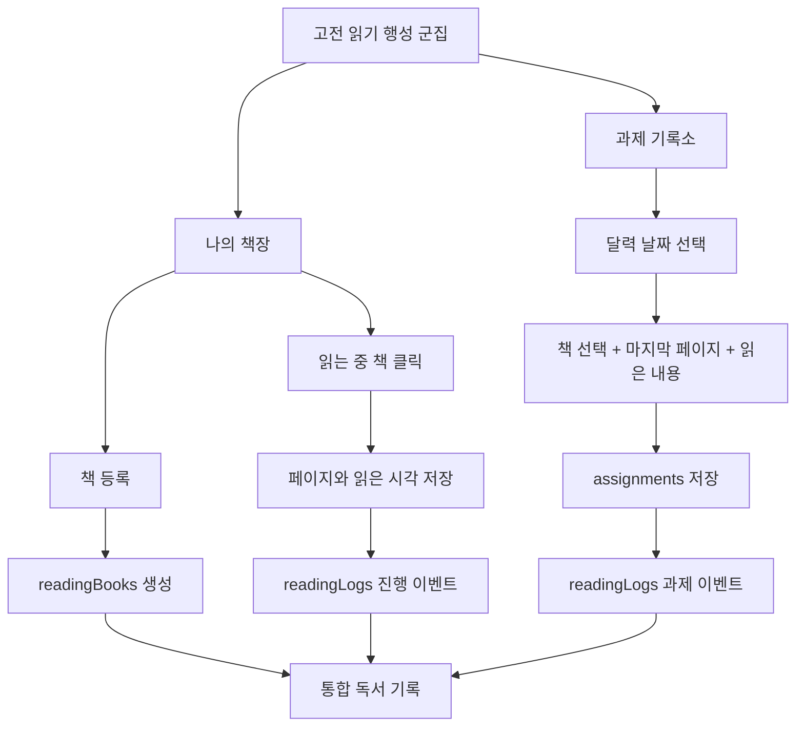

# 고전 읽기 독서 기록소·나의 책장 상세 계획 및 개발 설계

- 문서 상태: 구현 전 설계안 v2(외부 검토 의견 선별 반영)
- 대상 군집: `western-classic`(화면명: 고전 읽기)
- 작성일: 2026-08-16
- 기준 코드: React 19, Vite, Firebase Authentication/Firestore/Storage, TanStack Query

## 1. 문서 해석 원칙

첨부 이미지는 현재 화면과 정보 구조를 파악하기 위한 참고 자료로만 사용한다. 이미지 안의 버튼명, 안내문, 경고 정책 등은 새로운 요구사항으로 간주하지 않는다.

이번 설계가 반영하는 사용자 요청은 다음과 같다.

1. 고전 읽기 군집에는 기존의 `네버랜드 클래식`, `서양고전읽기`, `노벨문학상 수상작`, `과제 기록소`, `다크 매터`, `아스트라 프론티어`만 유지한다.
2. 위 목록에 새 `나의 책장` 행성을 추가한다.
3. 고전 읽기 군집의 나머지 진입점은 제거한다.
4. 과제 기록소의 달력·날짜 선택·제출 흐름은 유지하되 독서 기록에 맞게 바꾼다.
5. 과제를 제출할 때 등록된 책, 읽은 마지막 페이지, 읽은 내용 요약을 기록한다.
6. 책 제목과 저자로 책을 등록하고, 상태를 관리한다.
7. 나의 책장에서 상태를 쉽게 구별하며, 읽는 중인 책의 페이지를 바로 갱신한다.
8. 언제 어떤 책을 어디까지 읽었는지, 시작·완독 시점과 과제 내용을 한 화면에서 확인한다.

## 2. 핵심 제품 결정

### 2.1 고전 읽기 군집의 최종 행성 구성

고전 읽기 군집의 2D·3D 화면 모두 아래 7개 진입점만 노출한다.

| 순서 | 진입점 | 종류 | 처리 |
|---:|---|---|---|
| 1 | 아스트라 프론티어 | 공통 특수 행성 | 유지 |
| 2 | 과제 기록소 | 공통 특수 행성, 고전 읽기 전용 UI 적용 | 유지·개선 |
| 3 | 다크 매터 | 공통 특수 행성 | 유지 |
| 4 | 나의 책장 | 고전 읽기 전용 특수 행성 | 신규 |
| 5 | 네버랜드 클래식 | Firestore 지역 | 유지 |
| 6 | 서양고전읽기 | Firestore 지역 | 유지 |
| 7 | 노벨문학상 수상작 | Firestore 지역 | 유지 |

고전 읽기 군집에서는 현재 보이는 `오답노트 행성`, `다크매터 정제소`를 제거한다. 이때 제거는 다음 의미로 제한한다.

- 고전 읽기 군집의 2D 카드와 3D 진입점에서 보이지 않게 한다.
- 다른 수학·파이썬 군집의 기능은 변경하지 않는다.
- 기존 컴포넌트, 오답 데이터, 정제 기록을 삭제하지 않는다.
- Firestore의 지역·학습 데이터를 물리 삭제하지 않는다.

이 방식은 사용자가 원하는 화면 정리를 만족하면서 기존 학습 기록 손실과 다른 군집의 회귀를 막는다.

### 2.2 책 상태

초기 버전은 자유문구 대신 아래 3개 상태를 고정값으로 사용한다. 화면에는 자연스러운 한국어 문구를 보여주고 데이터에는 안정적인 영문 enum을 저장한다.

| 저장값 | 화면 표시 | 의미 | 대표 색상 |
|---|---|---|---|
| `reading` | 읽고 있어요 | 현재 계속 읽는 책 | 청록/파랑 |
| `completed` | 완독했어요 | 읽기를 마친 책 | 금색/초록 |
| `paused` | 읽기 중단 중입니다 | 잠시 또는 장기간 멈춘 책 | 회색/보라 |

고정 상태를 쓰면 책장 필터, 색상, 통계, 시작·완독 시각 계산이 일관된다. 등록 시 기본 상태는 `reading`이다.

### 2.3 기록 시각의 의미

아래 시간 필드의 의미를 분리해서 저장한다.

- `readAt`: 사용자가 실제로 읽었다고 기록한 절대 시각(Timestamp)
- `readDateKst`: `readAt`을 `Asia/Seoul` 기준으로 환산한 날짜 키(`YYYY-MM-DD`)
- `recordedAt`: 서버가 최초로 기록을 받은 시각
- `updatedAt`: 수정 가능한 과제 연결 로그가 마지막으로 바뀐 서버 시각

달력에서 선택한 날짜는 `readDateKst`가 되고, 제출 화면의 필드명은 소요 시간과 혼동되지 않도록 `읽은 시각`으로 표시한다. 오늘을 선택하면 현재 한국 시각이 기본값이다. 과거 날짜를 선택한 경우에도 사용자가 시각을 확인한 후 제출하도록 한다.

이 구분이 있어야 “8월 16일 오후 8시에 읽었고, 다음 날 기록을 제출했다”는 상황을 정확히 표현할 수 있다.

`durationMinutes`처럼 “몇 분 읽었는지”를 저장하는 기능은 이번 요청에 없고 필수 입력 부담을 늘리므로 MVP에 포함하지 않는다. 향후 통계 요구가 생기면 선택 입력으로 별도 도입한다.

### 2.4 현재 페이지의 의미

페이지 입력값은 “이번에 읽은 쪽 수”가 아니라 “이 기록 시점에 읽은 마지막 페이지”다.

- 허용값: 1~99,999 범위의 정수
- 한 번의 과제 제출에는 책 1권과 마지막 페이지 1개를 연결한다.
- 과거 기록을 뒤늦게 입력해 현재 책장 표시 페이지보다 작더라도 기록은 허용한다.
- 책 문서에는 `현재 페이지` 하나 대신 `progress.latestReadPage`와 `progress.furthestPage`를 구분한다.
- `latestReadPage`는 읽은 시각이 가장 최근인 유효 기록의 페이지다.
- `furthestPage`는 유효 기록 전체에서 가장 큰 페이지이며 책장 카드의 대표 페이지로 사용한다.
- 같은 `readAt`이면 문서 ID 내림차순을 보조 정렬로 사용해 최신 기록을 결정한다.
- 과거 기록은 `furthestPage`를 낮추지 않지만, 더 큰 페이지라면 올릴 수 있다.
- 잘못된 페이지 정정으로 최신값이나 최댓값이 바뀌면 서버가 유효 로그를 다시 계산해 두 요약값을 갱신한다.

### 2.5 기록의 기준 데이터

`readingLogs`를 독서 타임라인의 기준 데이터(source of truth)로 사용한다. `assignments`에는 관리자 검토와 기존 과제 기능을 위해 그 시점의 책 정보를 스냅샷으로 함께 저장한다.

- 책 정보 현재값: `readingBooks`
- 독서 활동·상태 변경 이력: `readingLogs`
- 과제 제출·피드백: 기존 `assignments` + `reading` 스냅샷

책 제목이나 저자를 나중에 수정해도 과거 과제 화면은 제출 당시의 스냅샷을 유지하고, 통합 독서 기록 화면은 필요에 따라 현재 책 정보와 스냅샷을 함께 사용할 수 있다.

### 2.6 현행 코드 분석과 설계 영향

현재 저장소에서 확인한 구조는 다음과 같다.

| 현행 구조 | 위치 | 설계 영향 |
|---|---|---|
| 특수 행성 카드가 JSX에 직접 나열됨 | `SpaceHome.jsx` | 고전 읽기 전용 허용 목록을 별도 설정으로 분리해야 함 |
| 지역 카드는 Firestore `regions` 결과를 모두 순회함 | `useContent.js`, `SpaceHome.jsx` | 세 지역의 안정적인 ID 허용 목록이 필요함 |
| 과제는 `assignments` 최상위 컬렉션에 저장됨 | `useAssignments.js` | 기존 관리자 검토·경고·공개 기능을 유지하면서 `reading` 맵을 확장해야 함 |
| 과제 조회는 지역이 아닌 군집 전체 기준임 | `useStudentAssignments` | 고전 읽기 세 지역 어디에서 들어와도 같은 독서 기록소를 보는 현재 동작을 유지할 수 있음 |
| UI는 날짜별 과제 한 건을 선택함 | `AssignmentHub.jsx` | 초기 버전은 날짜당 과제 한 건·책 한 권으로 명시해야 함 |
| 제출 가능 기간은 오늘 포함 최근 7일임 | `SubmissionPanel` | 독서 전용 폼에도 동일 정책을 유지함 |
| 글·링크는 localStorage, 파일은 IndexedDB에 임시저장됨 | `AssignmentHub.jsx` | 책·페이지·시간도 같은 초안 생명주기에 포함해야 함 |
| 학생 과제 쓰기 허용 필드가 제한되어 있음 | `firestore.rules` | UI보다 규칙 배포가 먼저이거나 동시에 이루어져야 함 |
| 항해 일지와 관리자 화면은 본문 중심임 | `AssignmentChronicle.jsx`, `AdminAssignmentDetail.jsx` | 새 독서 메타데이터와 레거시 배지를 두 화면 모두에 추가해야 함 |
| 계정 삭제 함수가 컬렉션별로 자료를 정리함 | `functions/index.js` | 새 책·로그 컬렉션을 명시적으로 삭제 대상에 포함해야 함 |

따라서 이 기능은 단순 폼 필드 추가가 아니라 내비게이션 정책, 독서 도메인, 원자적 쓰기, 보안 규칙, 기존 과제 호환을 함께 배포해야 한다.

## 3. 사용자 경험 설계

### 3.1 고전 읽기 행성 화면

고전 읽기일 때만 군집 내비게이션 구성을 명시적으로 적용한다. Firestore에 우연히 다른 지역이 추가되거나 공통 특수 카드가 늘어나도 자동 노출하지 않는다.

권장 카드 순서는 다음과 같다.

1. 아스트라 프론티어
2. 과제 기록소
3. 다크 매터
4. 나의 책장
5. 네버랜드 클래식
6. 서양고전읽기
7. 노벨문학상 수상작

모바일은 2열, 데스크톱은 현재 폭에 맞춘 3열 또는 유동 그리드를 사용한다. `나의 책장`은 책이 꽂힌 우주 서가 또는 빛나는 책 아이콘을 사용하되, 초기 구현은 기존 CSS/이모지 자산으로 완성하고 별도 이미지 제작은 후속 작업으로 둔다.

### 3.2 나의 책장 첫 화면

상단 메뉴는 두 개로 단순화한다.

- `나의 책장`: 등록한 책과 상태 관리
- `독서 기록`: 전체 독서 타임라인

책장 탭의 구조는 다음과 같다.

1. 상단 요약
   - 읽고 있어요 권수
   - 완독했어요 권수
   - 읽기 중단 권수
   - 최근 기록한 책과 페이지
2. 필터
   - 전체
   - 읽고 있어요
   - 완독했어요
   - 읽기 중단 중입니다
3. 책 카드 그리드
4. `+ 책 등록` 버튼

책 카드에는 아래 정보를 표시한다.

- 책 제목
- 저자
- 상태 배지와 색상
- 현재 페이지
- 마지막 독서 시각
- 시작일 또는 완독일

#### 상태별 카드 동작

- `reading`: 카드 클릭 시 상세 패널을 열고 페이지 입력란에 바로 초점을 둔다.
- `completed`: 카드 클릭 시 완독일과 전체 기록을 보여주며, `다시 읽기`로 상태를 바꿀 수 있다.
- `paused`: 카드 클릭 시 중단일과 마지막 페이지를 보여주며, `읽기 재개`가 가능하다.

### 3.3 책 등록

필수 입력은 요청대로 두 개뿐이다.

- 책 제목
- 저자

등록 폼에서 상태를 선택할 수 있으며 기본값은 `읽고 있어요`다. `읽고 있어요`로 등록하면 등록 시각을 최초 `startedAt`으로 저장한다. 완독 또는 중단 상태로 과거 책을 등록할 때는 상태 변경일을 선택할 수 있게 하되 기본값은 현재 시각이다.

검증 규칙:

- 제목: 공백 제거 후 1~200자
- 저자: 공백 제거 후 1~120자
- 제목·저자가 같은 기존 책이 있으면 중복 경고를 보여준다.
- 판본이 다른 경우 사용자가 확인 후 별도 등록할 수 있도록 중복을 강제 차단하지 않는다.

초기 범위에서는 표지 이미지, ISBN, 출판사, 총 페이지를 요구하지 않는다. 총 페이지가 없더라도 현재 페이지와 상태를 이용해 요청 기능을 모두 제공할 수 있다.

### 3.4 책장에서 페이지 저장

`읽고 있어요` 상태의 책 상세 패널에는 다음 입력을 둔다.

- 마지막으로 읽은 페이지: 필수
- 읽은 날짜·시간: 기본값 현재 한국 시간
- 한 줄 메모: 선택

저장하면 한 번의 트랜잭션으로 다음을 처리한다.

1. `readingLogs`에 `progress` 이벤트를 생성한다.
2. `readAt`과 문서 ID 순서에 따라 `progress.latestReadPage`와 `progress.latestReadAt`을 갱신한다.
3. 입력 페이지가 기존 최댓값보다 크면 `progress.furthestPage`를 갱신한다.
4. 책장과 독서 기록 쿼리를 무효화해 즉시 화면에 반영한다.

### 3.5 독서 과제 기록소

달력, 날짜 클릭, 제출 가능 기간, 관리자 피드백 같은 기존 골격은 유지한다. 단 `western-classic`일 때만 보고서 폼을 독서 전용으로 바꾼다. 다른 군집의 과제 제출 UI는 변경하지 않는다.

독서 전용 폼의 필드 순서:

1. `책 선택` — 필수, 등록된 책 검색/선택
2. `+ 새 책 등록` — 책이 없을 때 현재 화면을 떠나지 않고 등록
3. `어디까지 읽었나요?` — 마지막 페이지, 필수
4. `읽은 시각` — 필수, 날짜는 달력 선택값 고정
5. `오늘 읽은 내용` — 필수, 10자 이상
6. 링크·파일 — 기존 기능을 접을 수 있는 선택 영역으로 유지
7. 제출 버튼

제출 전 요약 예시:

> 2026년 8월 16일 20:10 · 어린 왕자 · 64페이지까지 · 오늘 읽은 내용 42자

#### 과제 수정

- 기존 정책대로 `reviewed` 전에는 수정 가능하다.
- 첫 제출 후 `bookId`는 바꿀 수 없고 페이지, 읽은 시각, 내용, 첨부만 수정할 수 있다.
- 제출 전에 책 제목과 저자를 포함한 확인 요약을 보여 잘못된 책 선택을 예방한다.
- 책을 잘못 연결한 제출은 일반 수정으로 처리하지 않고 관리자용 `연결 책 정정` 서버 작업으로 기존 책과 새 책의 진행도를 모두 재계산한다.
- 과제와 연결된 독서 로그는 별도 로그를 추가하지 않고 동일한 결정적 ID의 로그를 갱신하며 `revision`을 1씩 올린다.
- 사용자 타임라인은 최신 revision 한 건만 보여준다. 완전한 본문 수정 감사 이력은 MVP 범위에 포함하지 않고, 필요 시 별도 `assignmentRevisions` 컬렉션으로 확장한다.
- 관리자 확인 완료 후에는 기존 정책대로 수정할 수 없다.

책 연결을 잠그는 이유는 일반 수정에서 책 A의 파생 진행도를 되돌리고 책 B의 진행도를 다시 계산하는 복잡성과 오류 가능성을 MVP에서 차단하기 위해서다.

#### 책 상태 연계

- 과제 제출은 책의 상태를 자동으로 `completed`로 바꾸지 않는다.
- 사용자가 과제 제출 뒤 `완독했어요`를 선택하면 상태 이벤트와 `completedAt`을 별도로 저장한다.
- 일시 중단된 책을 과제에서 선택하면 `읽기 재개` 확인을 받고 `reading`으로 전환한다.
- 완독 책은 기본 선택 목록에서 접고, 사용자가 `완독한 책 포함`을 선택할 때만 노출한다.

#### 입력 부담 완화

- `읽고 있어요` 상태인 책이 한 권이면 기본 선택한다.
- 여러 권이면 마지막으로 기록한 책을 기본 선택하되 제목·저자를 제출 버튼 바로 위에 다시 보여준다.
- 달력 날짜와 현재 한국 시각을 자동 입력한다.
- 책 등록은 제목·저자만으로 끝내고 등록 직후 자동 선택한다.
- 책 등록 모달을 열고 닫아도 과제 초안은 유지한다.
- 페이지·시각·요약은 입력 즉시 기존 초안 저장 체계에 포함한다.
- 제출이나 네트워크 요청이 실패해도 입력값과 선택 책을 지우지 않는다.
- 모바일은 책 → 페이지 → 시각 → 요약의 한 열 흐름을 사용한다.

### 3.6 나의 독서 기록 화면

독서 기록 탭은 과제 제출과 책장 페이지 저장을 하나의 타임라인으로 합친다.

상단 요약:

- 현재 읽는 책 수
- 완독한 책 수
- 누적 독서 기록 수
- 최근 30일 기록일 수
- 최근 읽은 책과 페이지

필터:

- 기간: 전체 / 최근 7일 / 최근 30일 / 직접 선택
- 책
- 상태 또는 이벤트: 진행 기록 / 읽기 시작 / 완독 / 중단 / 재개
- 기록 출처: 과제 기록소 / 나의 책장

타임라인 한 항목의 표시 정보:

- 실제 읽은 날짜와 시간(`readAt`)
- 책 제목과 저자
- 마지막 페이지
- 과제 제출 내용 또는 책장 한 줄 메모
- 기록 출처
- 과제 연결 시 제출 상태와 교사 피드백 진입점

책별 상세 화면에서는 다음을 한눈에 보여준다.

- 최초 시작일
- 현재 상태
- 현재 페이지
- 완독일 또는 중단일
- 시간순 전체 진행 기록
- 연결된 과제 내용

## 4. 화면 흐름



## 5. 데이터 모델

### 5.1 `readingBooks/{bookId}`

사용자 소유 책의 현재 상태를 저장하는 최상위 컬렉션이다.

```js
{
  userId: "uid",
  title: "어린 왕자",
  author: "앙투안 드 생텍쥐페리",
  normalizedTitle: "어린왕자",
  normalizedAuthor: "앙투안드생텍쥐페리",
  status: "reading", // reading | completed | paused
  progress: {
    latestReadPage: 64,
    furthestPage: 64,
    latestReadAt: Timestamp,
    latestLogId: "logId"
  },
  startedAt: Timestamp,
  completedAt: null,
  pausedAt: null,
  statusUpdatedAt: Timestamp,
  archivedAt: null,
  createdAt: Timestamp,
  updatedAt: Timestamp,
  schemaVersion: 1
}
```

설계 규칙:

- 책은 독서 로그가 연결될 수 있으므로 즉시 영구 삭제하지 않고 `archivedAt`으로 보관 해제한다.
- `completedAt`은 `completed` 전환 시 설정한다.
- `pausedAt`은 `paused` 전환 시 설정한다.
- `reading`으로 재개할 때 기존 최초 `startedAt`은 유지한다.
- `progress`는 `readingLogs`에서 계산한 조회용 요약값이며 사실의 원본은 아니다.
- 일반 신규 기록은 요약값을 증분 갱신하고, 최신·최대 기록의 수정이나 정정은 서버가 유효 로그를 재조회해 다시 계산한다.
- 재독 기능을 나중에 확장할 경우 `readingCycle`을 별도 도입한다. 초기 구현에서는 한 책당 하나의 생애주기만 다룬다.

### 5.2 `readingLogs/{logId}`

독서 타임라인의 기준 이벤트 컬렉션이다. 책장 진행·상태 이벤트는 생성 후 수정하지 않고, 과제 연결 이벤트만 검토 전까지 최신 투영값으로 수정한다.

```js
{
  userId: "uid",
  bookId: "bookId",
  eventType: "progress", // progress | status_change | correction
  source: "assignment", // assignment | bookshelf
  readDateKst: "2026-08-16",
  readAt: Timestamp,
  page: 64,
  summary: "사막에서 여우를 만나 관계를 맺는 의미를 알게 되었다.",
  assignmentId: "assignmentId-or-null",
  statusFrom: null,
  statusTo: null,
  revision: 1,
  lockedAt: null,
  correctionOfLogId: null,
  voidedAt: null,
  bookSnapshot: {
    title: "어린 왕자",
    author: "앙투안 드 생텍쥐페리"
  },
  recordedAt: Timestamp,
  updatedAt: Timestamp,
  schemaVersion: 1
}
```

결정적 ID 규칙:

- 과제 연결 로그: `assignment__{assignmentId}`
- 책장 직접 기록: 자동 ID
- 상태 변경 로그: 자동 ID
- 페이지 정정 로그: 자동 ID, `correctionOfLogId`로 대상 기록 참조

과제 수정 시 동일 로그를 갱신하고 `revision`만 증가시키므로 한 과제 때문에 사용자 타임라인 항목이 중복되지 않는다. `reviewed` 전환 시 `lockedAt`을 설정하고 이후 과제와 연결 로그를 함께 잠근다. 책장 직접 기록의 정정은 원본을 덮어쓰지 않고 `correction` 이벤트를 생성하며, 서버 투영 계산은 정정이 적용된 유효 페이지를 사용한다.

### 5.3 기존 `assignments/{assignmentId}` 확장

기존 필드는 유지하고 `reading` 맵을 추가한다.

```js
{
  // 기존 필드 생략
  clusterId: "western-classic",
  date: "2026-08-16",
  content: "오늘 읽은 내용 요약",
  reading: {
    bookId: "bookId",
    title: "어린 왕자",
    author: "앙투안 드 생텍쥐페리",
    page: 64,
    readAt: Timestamp,
    readDateKst: "2026-08-16",
    revision: 1,
    schemaVersion: 1
  }
}
```

`title`과 `author`는 과제 제출 시점 스냅샷이다. 책이 보관 처리되거나 제목이 수정되어도 관리자 과제 검토와 과거 기록이 깨지지 않는다.

### 5.4 `readingCommands/{commandDocId}`

네트워크 재시도와 중복 클릭을 안전하게 처리하는 서버 전용 멱등 기록이다. 클라이언트는 읽거나 쓰지 않는다.

```js
{
  userId: "uid",
  commandId: "uuid",
  type: "submit_assignment", // create_book | save_progress | update_status | submit_assignment
  payloadHash: "sha256",
  status: "completed",
  targetId: "assignment-or-log-id",
  result: { assignmentId: "assignmentId", logId: "logId" },
  completedAt: Timestamp,
  expiresAt: Timestamp
}
```

- 문서 ID는 `{uid}__{commandId}` 형식으로 충돌을 방지한다.
- 같은 `commandId`와 같은 `payloadHash`는 저장된 결과를 재사용한다.
- 같은 `commandId`에 다른 payload가 오면 거부한다.
- `expiresAt`은 완료 후 30일로 두고 Firestore TTL 또는 서버 정리 작업으로 제거한다.
- 계정 삭제 시 TTL을 기다리지 않고 해당 사용자의 명령 문서를 즉시 삭제한다.

### 5.5 시간대 변환

브라우저의 현지 시간대에 의존하지 않는다.

1. 달력에서 `YYYY-MM-DD`를 얻어 `readDateKst`로 사용한다.
2. 입력된 `HH:mm`과 결합한다.
3. 명시적으로 `+09:00` 오프셋을 붙여 Timestamp로 변환한다.
4. 화면 표시도 `Asia/Seoul`을 지정한 `Intl.DateTimeFormat`을 사용한다.
5. 서버는 변환된 `readAt`을 다시 `Asia/Seoul`로 환산해 `readDateKst`와 일치하는지 검증한다.

## 6. 쓰기 일관성

### 6.1 과제 제출 트랜잭션

기존 과제 제출은 클라이언트의 단일 `assignments` 쓰기지만, 고전 읽기 신규 쓰기는 서버 Callable Function을 기준 경로로 사용한다. 현재 저장소가 `firebase-functions/v1`과 `asia-northeast3` 지역 함수를 사용하므로 이번 기능만 Gen 2로 혼합하지 않고 기존 런타임 관례에 맞춘다.

`submitClassicReadingAssignment` 함수가 아래 세 문서를 Admin SDK 트랜잭션으로 저장한다.

1. `assignments/{assignmentId}`
2. `readingLogs/assignment__{assignmentId}`
3. `readingBooks/{bookId}`

처리 순서:

1. 파일이 있다면 Storage 업로드를 먼저 완료한다.
2. 클라이언트가 `commandId`와 입력 스냅샷을 Callable Function에 전달한다.
3. 서버가 인증 사용자, 책 소유권, 군집, 날짜, 페이지, 문자열 길이, 제출 가능 기간, 과제 잠금 상태를 검증한다.
4. 사용자·고전 읽기·날짜 조합으로 결정적 과제 ID를 계산해 날짜별 중복 문서를 방지한다.
5. 트랜잭션에서 과제와 결정적 독서 로그를 생성 또는 갱신한다.
6. 최초 제출 후 기존 `bookId`와 요청 `bookId`가 다르면 `BOOK_CHANGE_LOCKED`로 거부한다.
7. 새 기록이 최신 또는 최대 후보면 책 `progress`를 증분 갱신한다.
8. 기존 최신·최대 후보를 낮추는 수정이면 해당 책의 유효 로그를 다시 조회해 `latestReadPage`, `furthestPage`, `latestReadAt`, `latestLogId`를 재계산한다.
9. 처리 결과를 서버 전용 명령 문서에 기록하고 동일 `commandId` 재호출에는 같은 결과를 반환한다.

트랜잭션 실패 시 새로 업로드한 파일이 고아 파일로 남지 않도록 업로드된 경로를 정리하는 보상 로직을 추가한다.

함수 실행 옵션은 기존 비용 최적화 관례에 맞춰 `memory: "256MB"`, `timeoutSeconds: 60`, 제한된 `maxInstances`를 명시한다. `minInstances`는 지정하지 않아 유휴 인스턴스 비용을 만들지 않는다. 실시간 리스너나 외부 AI 호출은 포함하지 않는다.

### 6.2 책장 진행 저장 트랜잭션

`saveReadingProgress` Callable Function이 다음을 처리한다.

1. 인증 사용자와 책 소유권을 확인한다.
2. 상태가 `reading`인지 확인한다.
3. `readingLogs` 진행 이벤트를 생성한다.
4. 책의 `progress` 요약을 같은 트랜잭션에서 갱신한다.
5. 동일 `commandId` 재호출에는 새 로그를 만들지 않고 기존 결과를 반환한다.

### 6.3 상태 변경 트랜잭션

상태 변경은 책 현재값과 상태 이벤트를 함께 저장한다.

- `reading → completed`: `completedAt` 설정, `status_change` 로그
- `reading → paused`: `pausedAt` 설정, `status_change` 로그
- `paused → reading`: 최초 `startedAt` 유지, `pausedAt` 유지 또는 이력용으로 로그에 보존, `status_change` 로그
- `completed → reading`: 명시적 `다시 읽기` 확인 후 허용; 초기 버전에서는 기존 완독일을 유지하고 상태 이벤트로 재개 사실을 남긴다.

책 생성과 상태 변경도 각각 `createReadingBook`, `updateReadingBookStatus` Callable Function을 사용한다. Admin SDK는 보안 규칙을 우회하므로 함수가 인증, 소유권, 허용 필드, 문자열·숫자 범위, 상태 전환을 모두 직접 검증한다.

### 6.4 멱등성과 클라이언트 재시도

- 모든 독서 쓰기 명령은 UUID 형식의 `commandId`를 요구한다.
- 서버 전용 `readingCommands/{uid}__{commandId}` 문서에 작업 종류, 대상 ID, 완료 상태, 결과를 저장한다.
- 같은 명령이 두 번 도착하면 두 번째 호출은 새 쓰기를 만들지 않고 첫 결과를 반환한다.
- 트랜잭션 함수 내부에서는 토스트·알림·외부 호출 같은 부수 효과를 수행하지 않는다.
- UI 성공 알림은 최종 Callable 응답을 받은 뒤 한 번만 표시한다.
- 클라이언트 트랜잭션에 의존하지 않으므로 오프라인에서는 제출을 성공 처리하지 않는다. 대신 초안을 유지하고 연결 복구 후 사용자가 재시도하게 한다.

## 7. Firestore 보안 설계

`readingBooks`와 `readingLogs`는 기존 `users/{uid}` 하위의 포괄 규칙을 사용하지 않고 최상위 컬렉션에 둔다. 이유는 현재 사용자 하위 포괄 규칙이 소유자의 모든 하위 컬렉션 쓰기를 넓게 허용하여 필드별 검증을 강제하기 어렵기 때문이다.

접근 원칙:

- 학생: 본인 책과 기록만 읽기, 쓰기는 Callable Function으로 요청
- 연결된 학부모: 읽기만 가능
- 관리자: 읽기 가능, 관리 작업은 관리자용 Callable Function으로 요청
- 다른 인증 사용자: 접근 불가
- 공개 공유: 원본 독서 로그가 아니라 기존 `assignmentShares` 서버 흐름을 사용

`readingBooks`, `readingLogs`, `readingCommands`의 클라이언트 `create`, `update`, `delete`는 모두 거부한다. 따라서 필드·소유권·상태 전환 검증의 기준 구현은 Callable Function 내부의 공용 도메인 검증 함수다. 규칙은 읽기 권한만 책임지고 서버 함수 테스트는 쓰기 계약을 책임진다.

학부모 읽기 권한은 책 문서 안의 `parentIds` 같은 학생 수정 가능 필드를 절대 신뢰하지 않는다. 현재 `firestore.rules`의 기존 서버 관리 관계 판정 함수 `isLinkedParentOf(userId)`와 그 근거 데이터를 그대로 사용한다. 학부모 화면 쿼리도 연결된 자녀의 `userId`로 제한하며, 규칙이 목록 결과를 사후 필터링해 줄 것이라고 가정하지 않는다.

기존 과제 규칙에는 다음을 추가한다.

- `western-classic` 신규 제출·본문 수정은 클라이언트 직접 쓰기를 거부하고 Callable Function만 사용
- 다른 군집은 `reading`이 없어야 함
- 레거시 고전 과제의 관리자 피드백·학생 피드백 응답은 새 필드가 없어도 계속 허용
- 구버전 클라이언트가 고전 읽기 과제를 직접 제출하면 명확한 업그레이드 안내를 표시할 수 있도록 `permission-denied`를 앱 오류 코드로 변환

현재 `assignments` 전체 읽기 정책은 이번 기능 범위를 넘는 기존 보안 부채다. 독서 원본 컬렉션은 처음부터 비공개로 만들고, 과제 읽기 정책 강화는 별도 회귀 검토 후 진행한다.

## 8. 쿼리와 인덱스

권장 쿼리:

- 내 책 전체: `readingBooks where userId == uid`, 클라이언트에서 상태·최근 시각 정렬
- 상태별 책: `userId == uid AND status == value ORDER BY updatedAt desc`
- 내 독서 기록: `userId == uid ORDER BY readAt desc, documentId desc`
- 책별 기록: `userId == uid AND bookId == bookId ORDER BY readAt desc, documentId desc`
- 과제 로그 연결: 결정적 문서 ID로 직접 읽기

`firestore.indexes.json`에 다음 복합 인덱스를 추가한다.

1. `readingBooks`: `userId ASC`, `status ASC`, `updatedAt DESC`
2. `readingLogs`: `userId ASC`, `readAt DESC`, 문서 ID `DESC`
3. `readingLogs`: `userId ASC`, `bookId ASC`, `readAt DESC`, 문서 ID `DESC`
4. 관리자 전체 조회가 필요할 때만 `readingLogs`: `bookId ASC`, `readAt DESC`

초기 페이지 크기는 최근 기록 20개로 하고 `(lastReadAt, lastDocumentId)` 두 값을 사용하는 `startAfter` 기반 더 보기를 사용한다. 같은 시각의 로그가 여러 개여도 중복·누락이 없어야 한다. 책장 카드 수가 적더라도 독서 로그는 계속 증가하므로 전체 문서를 한 번에 읽거나 실시간 리스너로 유지하지 않는다.

복합 인덱스 폭증을 막기 위해 MVP 필터 조합은 아래 네 가지로 제한한다.

- 전체 + 기간
- 책 + 기간
- 이벤트 종류 + 기간
- 기록 출처 + 기간

책·이벤트·출처를 동시에 결합하는 임의 필터는 제공하지 않는다. 타임라인은 `bookSnapshot`으로 카드에 필요한 제목·저자를 표시해 책 문서 추가 읽기를 만들지 않는다.

## 9. 코드 구조

### 9.1 신규 파일

```text
src/
  components/Space/ReadingLibrary/
    ReadingLibraryView.jsx
    ReadingLibrary.css
    ReadingBookshelfTab.jsx
    ReadingHistoryTab.jsx
    ReadingBookCard.jsx
    ReadingBookFormModal.jsx
    ReadingProgressModal.jsx
    ReadingBookDetailDrawer.jsx
  hooks/
    useReadingLibrary.js
  utils/
    readingDomain.js
    readingTime.js
  constants/
    westernClassicNavigation.js
scripts/
  audit-western-classic-reading-migration.mjs
functions/
  classicReading.js
  classicReadingPolicy.js
  classicReading.test.cjs
```

### 9.2 수정 파일

| 파일 | 변경 내용 |
|---|---|
| `src/components/Space/SpaceHome.jsx` | `reading_library` 루트 뷰, 고전 읽기 카드 제한, 나의 책장 카드·화면 연결 |
| `src/components/Space/SpaceScene.jsx` | 3D 고전 읽기 진입점도 같은 구성 정책 적용 |
| `src/components/Space/AssignmentHub.jsx` | 고전 읽기 전용 폼, 책 선택·페이지·시간, 임시저장 확장 |
| `src/components/Space/AssignmentChronicle.jsx` | 책·저자·페이지·읽은 시각 표시, 레거시 표시 |
| `src/components/Admin/AdminAssignmentDetail.jsx` | 관리자 과제 검토 화면에 독서 메타데이터 표시 |
| `src/hooks/useAssignments.js` | 고전 읽기 제출을 서버 Callable Function으로 라우팅하고 기존 군집 제출은 유지 |
| `src/hooks/useAssignmentShares.js` 및 서버 공유 함수 | 공개 스냅샷에 허용된 책 정보만 포함 |
| `firestore.rules` | 새 컬렉션 소유권·필드 검증, 과제 `reading` 맵 검증 |
| `firestore.indexes.json` | 책장·타임라인 복합 인덱스 |
| `functions/index.js` | 독서 함수 등록, 계정 삭제 시 책·독서 로그 삭제, 공유 스냅샷 지원 |
| `functions/classicReading.js` | 인증·멱등성·트랜잭션을 담당하는 고전 읽기 Callable Functions |
| `functions/classicReadingPolicy.js` | 서버 입력 검증·진행도 계산·상태 전환 순수 함수 |

### 9.3 행성 구성 정책 분리

현재 `SpaceHome.jsx`에는 특수 카드가 JSX로 직접 나열되어 있고 지역은 `regions.map`으로 모두 노출된다. 구현 시 고전 읽기 규칙을 한 곳에 모은다.

```js
export const WESTERN_CLASSIC_REGION_IDS = new Set([
  'reg_1776154036888', // 네버랜드 클래식
  'reg_1776158746744', // 서양고전읽기
  'reg_1776240768916'  // 노벨문학상 수상작
]);

export const WESTERN_CLASSIC_SPECIAL_DESTINATIONS = [
  'astra_frontier',
  'assignment_hub',
  'dark_matter',
  'reading_library'
];
```

화면명은 변경될 수 있으므로 ID를 1차 기준으로 사용하고, 마이그레이션 기간에만 제목을 보조 기준으로 쓴다. 잘못된 ID나 중복 지역은 개발 모드 경고와 감사 스크립트로 발견한다.

### 9.4 독서 훅 공개 인터페이스

UI가 Firestore 세부사항을 직접 다루지 않도록 `useReadingLibrary.js`가 다음 인터페이스를 제공한다.

```js
useReadingBooks(userId, { status })
useReadingBook(bookId)
useReadingLogs(userId, { bookId, source, eventType, dateFrom, dateTo })
useCreateReadingBook()
useUpdateReadingBookStatus()
useSaveReadingProgress()
useArchiveReadingBook()
```

고전 과제 제출은 기존 `useSubmitAssignment()`의 공개 호출 형태를 유지하되, `assignmentData.reading`이 있을 때 `submitClassicReadingAssignment` Callable Function을 호출한다. 책 등록·페이지 저장·상태 변경 훅도 직접 Firestore 쓰기가 아니라 각각의 Callable Function을 호출한다. 성공 후 다음 쿼리를 함께 무효화한다.

```text
assignments/student/{userId}
readingBooks/{userId}
readingBook/{bookId}
readingLogs/{userId}
```

뮤테이션 오류는 화면에서 분기할 수 있도록 안정적인 코드로 변환한다.

| 오류 코드 | 의미 |
|---|---|
| `BOOK_NOT_FOUND` | 선택한 책이 없거나 보관 처리됨 |
| `BOOK_FORBIDDEN` | 책 소유자가 현재 사용자와 다름 |
| `INVALID_READING_PAGE` | 페이지가 유효한 정수가 아님 |
| `INVALID_READ_AT` | 날짜·시간을 한국 시간으로 변환할 수 없음 |
| `ASSIGNMENT_LOCKED` | 관리자 검토 완료로 수정 불가 |
| `BOOK_CHANGE_LOCKED` | 첫 제출 뒤 연결 책 변경 시도 |
| `DUPLICATE_COMMAND` | 이미 완료된 명령을 다른 본문으로 재사용 |
| `READING_WRITE_FAILED` | 원자적 쓰기 전체 실패 |

## 10. 상태 관리와 임시저장

기존 과제 폼은 `localStorage`와 IndexedDB를 이용해 내용·링크·파일을 임시저장한다. 독서 필드를 같은 초안에 포함한다.

```js
{
  assignmentId,
  dateStr,
  clusterId,
  readingBookId,
  readingPage,
  readingClockTime,
  content,
  links,
  existingAttachments,
  updatedAt
}
```

초안 복구 시 주의점:

- 저장된 책이 보관 처리되었으면 `책을 다시 선택해 주세요`를 표시한다.
- 저장된 페이지가 숫자가 아니면 제출을 막되 내용 초안은 버리지 않는다.
- 날짜를 이동할 때 현재처럼 이탈 확인을 유지한다.
- 책·페이지·읽은 시각 변경도 `dirty` 판정에 포함한다.

## 11. 레거시 데이터 처리

기존 `western-classic` 과제에는 책과 페이지가 없다. 제목이나 본문을 분석해 책을 임의로 추정하지 않는다.

표시 정책:

- 기존 과제: `책 정보 없음 · 기존 기록` 배지
- 내용·첨부·피드백: 기존대로 표시
- 통합 독서 기록: 기본적으로 포함하되 책 필터에서는 `미분류 기존 기록`으로 제공
- 검토 전 과제를 학생이 수정하면 책·페이지·읽은 시각 입력을 요구해 새 형식으로 전환
- 검토 완료 과제는 불변으로 유지

마이그레이션 절차:

1. 읽기 전용 감사 스크립트로 고전 읽기 과제 수와 사용자별 분포를 출력한다.
2. 새 컬렉션과 규칙을 먼저 배포한다.
3. 신규 쓰기를 새 형식으로 전환한다.
4. 기존 기록은 화면 호환으로 제공한다.
5. 필요할 때만 관리자가 과제와 책을 수동 연결하는 별도 도구를 만든다.

지역과 특수 행성 데이터는 삭제 마이그레이션을 실행하지 않는다.

### 11.1 책 보관과 계정 삭제

- 책장 제거는 `archivedAt`을 설정하는 보관 처리이며 연결 로그는 유지한다.
- 보관된 책은 기본 책장과 새 과제 선택 목록에서 제외하지만 과거 타임라인은 `bookSnapshot`으로 정상 표시한다.
- 계정 삭제는 기존 서버 계정 삭제 흐름이 `readingBooks`, `readingLogs`, `readingCommands`를 `userId`로 반복 조회해 배치 삭제한다.
- 한 번의 배치 한도를 넘는 500개 이상의 로그도 커서 기반으로 끝까지 처리한다.
- 삭제 작업은 중간 실패 후 같은 사용자에 대해 다시 실행해도 안전한 멱등 작업이어야 한다.
- 삭제 완료 조건은 세 컬렉션의 잔여 문서가 모두 0개인 것이다.

## 12. 오류·빈 상태

| 상황 | 사용자 처리 |
|---|---|
| 등록된 책 없음 | 책 선택 대신 `첫 책을 등록해 주세요`와 등록 버튼 표시 |
| 책 저장 실패 | 입력을 유지하고 재시도 버튼 표시 |
| 과제는 저장됐으나 로그 실패 | 트랜잭션이므로 전체 실패 처리, 부분 성공 금지 |
| 파일 업로드 뒤 트랜잭션 실패 | 새 업로드 파일 정리 후 재시도 안내 |
| 과거 기록 페이지가 현재보다 작음 | 허용하되 책장 대표값인 `furthestPage`가 낮아지지 않는다는 안내 |
| 완독 책 선택 | 기본 숨김, 사용자가 포함 옵션을 켠 경우 선택 가능 |
| 보관된 책과 연결된 과거 기록 | 스냅샷 제목·저자로 정상 표시 |
| 네트워크 오프라인 | 읽기 캐시는 표시, 쓰기는 초안 보존 후 온라인 재시도 |
| 레거시 과제 | `미분류 기존 기록`으로 안전하게 표시 |

## 13. 접근성·반응형 기준

- 상태를 색으로만 구분하지 않고 텍스트 배지와 아이콘을 함께 쓴다.
- 카드 전체를 키보드로 선택할 수 있게 `button` 의미를 사용한다.
- 모달은 초점 고정, ESC 닫기, 닫은 뒤 원래 카드로 초점 복귀를 지원한다.
- 페이지 입력은 `inputMode="numeric"`, 명확한 라벨, 오류 문구를 제공한다.
- 모바일 320px 폭에서도 책 제목·버튼이 겹치지 않는다.
- 타임라인 날짜는 스크린리더가 이해할 수 있는 전체 날짜 텍스트를 제공한다.
- 애니메이션 감소 설정(`prefers-reduced-motion`)을 존중한다.

## 14. 구현 단계

### 1단계 — 군집 내비게이션 정리

1. 고전 읽기 지역 ID와 특수 진입점 설정을 분리한다.
2. 2D 화면을 최종 7개 카드로 제한한다.
3. 3D 화면에 같은 정책을 적용한다.
4. 다른 군집의 카드 구성이 변하지 않는지 확인한다.

완료 기준: 고전 읽기에서 정확히 7개만 보이고 오답노트·정제소 진입점은 없다.

### 2단계 — 독서 도메인 계약 확정

1. 시간·페이지 투영·상태 전환·로그 revision·책 변경 잠금 규칙을 순수 함수로 만든다.
2. `commandId` 멱등 계약과 오류 코드를 확정한다.
3. 서버 정책 단위 테스트를 작성한다.

완료 기준: 같은 입력에서 시간·페이지·수정·상태 결과가 결정적으로 계산된다.

### 3단계 — 인덱스·보안 규칙·서버 트랜잭션

1. 필요한 인덱스를 먼저 배포하고 생성 완료를 확인한다.
2. 새 독서 컬렉션의 읽기 규칙과 서버 전용 쓰기 차단 규칙을 배포한다.
3. Callable Functions와 서버 트랜잭션을 구현한다.
4. `useReadingLibrary` 쿼리·뮤테이션과 고전 과제 제출 훅을 서버 계약에 연결한다.
5. 소유권·멱등성·동시성·계정 삭제 통합 테스트를 통과시킨다.
6. 새 클라이언트를 기능 플래그 비활성 상태로 배포해 Callable 연결을 검증한다.
7. 기능 플래그 활성화 후 고전 읽기 제출이 서버 경로로 전환되었는지 관찰한다.
8. 마지막으로 `western-classic` 과제의 구버전 직접 쓰기를 차단한다.

완료 기준: 다른 사용자가 책·기록을 읽거나 수정할 수 없고, 본인·관리자·연결 학부모 권한이 설계대로 동작한다.

### 4단계 — 나의 책장

1. 책 등록 모달을 만든다.
2. 상태별 책 카드와 필터를 만든다.
3. 읽는 중 책의 페이지 저장 흐름을 만든다.
4. 상태 전환과 시작·완독·중단 시각 기록을 만든다.

완료 기준: 책 등록부터 페이지 저장, 상태 변경까지 새로고침 후에도 일관되게 남는다.

### 5단계 — 독서 기록

1. `readingLogs` 페이지네이션 쿼리를 만든다.
2. 전체 타임라인과 책별 상세 타임라인을 만든다.
3. 기간·책·이벤트·출처 필터를 만든다.
4. 시작일·완독일 요약을 연결한다.

완료 기준: 과제 기록과 책장 기록을 시간순으로 함께 볼 수 있다.

### 6단계 — 과제 기록소 통합

1. 고전 읽기 전용 폼을 분기한다.
2. 책·페이지·읽은 시각을 초안 저장에 포함한다.
3. 고전 과제 제출을 서버 Callable Function에 연결한다.
4. 항해 일지와 관리자 상세에 독서 정보를 표시한다.
5. 기존 과제 호환 표시를 추가한다.

완료 기준: 달력 날짜에서 독서 과제를 제출하면 통합 기록이 즉시 생성되고 책 진행 요약은 `latestReadPage`·`furthestPage` 규칙과 일치한다.

### 7단계 — 운영 준비

1. 레거시 감사 스크립트를 dry-run한다.
2. 계정 삭제 로직에 새 컬렉션을 포함한다.
3. 로컬 Emulator와 스테이징에서 회귀 테스트한다.
4. 인덱스 생성 완료와 규칙·함수 배포 순서를 확인한다.
5. 기능 플래그로 관리자 계정, 소규모 학생 계정 순서로 확인한다.
6. 오류율·중복 명령·함수 호출량을 관찰한 뒤 전체 사용자에게 활성화한다.

## 15. 테스트 계획

### 15.1 단위 테스트

- 상태 전환 허용 여부
- 제목·저자 정규화와 중복 경고
- 페이지 정수·범위 검증
- 한국 시간 `readAt` 생성과 `readDateKst` 일치 검증
- `latestReadPage`·`furthestPage` 계산과 과거 기록 입력
- 동일 `readAt`에서 문서 ID 보조 정렬
- 정정 이벤트 적용 후 진행 투영 재계산
- 과제 revision 증가와 검토 후 잠금
- 첫 제출 후 `bookId` 변경 거부
- 고전 읽기 지역·특수 카드 필터
- 레거시 과제 판별

### 15.2 Firestore 규칙·Callable 통합 테스트

- Callable을 통한 본인 책 생성·수정 성공
- 모든 독서 컬렉션의 클라이언트 직접 쓰기 실패
- 본인 문서 직접 읽기와 허용 쿼리 성공
- 타인 문서 직접 읽기와 목록 쿼리 실패
- 연결 학부모 읽기 성공, 쓰기 실패
- 허용하지 않은 상태·필드·페이지 거부
- 과제 `reading.bookId`가 타인 책이면 제출 거부
- 세 문서 트랜잭션의 원자성
- 과제 수정 시 결정적 로그 중복 없음
- 같은 `commandId`를 두 번 호출해도 로그 한 건만 생성
- 같은 `commandId`에 다른 본문을 보내면 거부
- 두 브라우저에 해당하는 동시 페이지 저장 후 진행 투영 일치
- 구버전 클라이언트의 고전 과제 직접 쓰기 거부와 앱 안내

### 15.3 UI 통합 테스트

- 책이 없는 상태에서 과제 화면 내 등록
- 등록 직후 선택 목록 갱신
- 오늘·과거 날짜의 읽은 시각 입력
- 읽는 중 카드 클릭 후 페이지 저장
- 상태 필터와 배지 구분
- 완독·중단·재개 타임라인
- 검토 전 과제 수정과 검토 후 잠금
- 첫 제출 후 책 변경 시도 차단과 안내
- 네트워크 실패 후 모든 초안 필드 보존
- 트랜잭션 재시도에도 성공 알림 한 번만 표시
- 레거시 과제 표시
- 모바일 2열 카드와 모달 스크롤

### 15.4 회귀 테스트

- 다른 군집의 과제 제출 폼이 기존과 동일함
- 오답노트와 정제소가 다른 군집에서 계속 동작함
- 아스트라 프론티어·다크 매터 진입 정상
- 관리자 과제 목록·피드백·보상 정상
- 과제 공개 기능이 책 원본 컬렉션을 직접 노출하지 않음
- KST 23:59와 다음 날 00:01의 날짜 구분
- 같은 `readAt` 기록 페이지네이션의 중복·누락 없음
- 고전 읽기 노출 진입점 ID 집합이 정확히 7개와 일치
- 500개 초과 로그 계정 삭제와 중간 실패 후 재실행
- 계정 삭제 시 책·로그·명령 문서가 남지 않음

## 16. 인수 조건

다음 조건을 모두 만족하면 기능 완료로 본다.

1. 고전 읽기 군집에 최종 7개 진입점만 보인다.
2. 네버랜드 클래식·서양고전읽기·노벨문학상 수상작 데이터와 진입이 유지된다.
3. 아스트라 프론티어·과제 기록소·다크 매터 진입이 유지된다.
4. 오답노트 행성·다크매터 정제소는 고전 읽기에서 보이지 않는다.
5. 제목과 저자만으로 책을 등록할 수 있다.
6. 등록 책에 3개 상태를 지정하고 화면에서 쉽게 구별할 수 있다.
7. 읽는 중 책을 클릭해 마지막 페이지를 저장할 수 있다.
8. 과제 제출 시 등록 책, 마지막 페이지, 읽은 시각, 내용 요약이 필수다.
9. 과제 제출·수정이 독서 로그와 책 `latestReadPage`·`furthestPage`에 원자적으로 반영된다.
10. 독서 기록에서 날짜·시간, 책, 페이지, 과제 내용, 시작·완독 시점을 확인할 수 있다.
11. 기존 고전 과제는 손실 없이 `미분류 기존 기록`으로 보인다.
12. 다른 군집 기능과 기존 오답 데이터에는 변화가 없다.
13. 모바일·데스크톱·키보드 사용에서 주요 흐름을 완료할 수 있다.
14. 보안 규칙상 타인의 비공개 책과 독서 기록에 접근할 수 없다.

## 17. 구현 전 확정값과 후속 확장

이번 설계에서 바로 구현할 기본값:

- 상태는 3개 고정 선택값
- 책 등록 필수값은 제목·저자
- 과제 한 건당 책 한 권
- 페이지는 마지막으로 읽은 페이지
- 실제 읽은 날짜·시각은 별도 필수 입력
- 독서 소요 시간(분)은 MVP에 포함하지 않음
- 첫 제출 뒤 연결 책은 일반 수정으로 변경할 수 없음
- 독서 쓰기는 서버 Callable Function과 `commandId` 멱등 계약을 사용
- 기존 링크·파일 첨부는 선택 기능으로 유지
- 기존 데이터를 물리 삭제하지 않음

후속 확장 후보:

- 책 표지·ISBN·출판사·총 페이지
- 여러 번 재독을 구분하는 독서 회차
- 월별 독서량 차트와 연속 독서일
- 교사 추천 도서와 학생 책장의 연결
- 여러 책을 하루 과제 하나에 기록
- CSV/PDF 독서 기록 내보내기

후속 기능은 초기 데이터 모델의 `schemaVersion`과 이벤트 구조를 통해 추가할 수 있지만, 이번 구현 범위에는 포함하지 않는다.

## 18. 외부 검토 의견 반영 결정 기록

이번 보완에서는 제안 내용을 그대로 수용하지 않고 현재 요청과 저장소 구조를 기준으로 판단했다.

| 검토 의견 | 결정 | 문서 반영 |
|---|---|---|
| 노출 카드 수가 아니라 ID 집합을 검사 | 채택 | 내비게이션·회귀 테스트에 정확한 ID 집합 검증 추가 |
| `readAt`, 한국 날짜 키, 서버 기록 시각 분리 | 채택 | `readAt`, `readDateKst`, `recordedAt`, `updatedAt`으로 의미 확정 |
| 독서 소요 시간 `durationMinutes` 필수 추가 | 미채택 | 원 요청은 “몇 시에”이며 제출 부담을 늘리므로 MVP 제외 |
| 최신 페이지와 최대 페이지 분리 | 채택 | 책 `progress.latestReadPage`·`furthestPage` 투영 도입 |
| 과제 타임라인과 완전한 감사 로그 분리 | 부분 채택 | 결정적 타임라인 로그와 revision은 도입, 본문 전체 revision 보관은 후속 확장 |
| 최초 제출 뒤 책 변경 금지 | 채택 | 일반 수정에서 `bookId` 잠금, 관리자 정정만 별도 서버 작업으로 허용 |
| Gen 2 Callable Function 사용 | 부분 채택 | 서버 함수 원칙은 채택하되 현재 코드베이스와 같은 지역형 Functions v1 런타임 사용 |
| 서버 쓰기와 `commandId` 멱등성 | 채택 | 독서 쓰기 전부 Callable Function 경유, 서버 명령 문서로 중복 방지 |
| 책 문서의 `parentIds`로 학부모 권한 판정 | 명시적 배제 | 기존 서버 관리 관계와 `isLinkedParentOf`만 신뢰 |
| 읽는 중 책 기본 선택·간편 등록·초안 보존 | 채택 | 입력 부담 완화 절에 반영 |
| 상태 문구를 `잠시 멈췄어요`로 변경 | 미채택 | 사용자가 제시한 `읽기 중단 중입니다` 문구를 우선 유지 |
| 두 필드 커서와 필터 조합 제한 | 채택 | `(readAt, documentId)` 페이지네이션, 네 가지 필터 조합으로 제한 |
| 보관 처리와 500개 초과 재시도 삭제 | 채택 | 보관·계정 삭제 정책과 테스트에 반영 |
| 인덱스·규칙·서버 계약을 UI보다 먼저 구현 | 채택 | 구현 단계를 백엔드 계약 우선 순서로 재구성 |

이 결정 기록은 구현 중 범위가 다시 흔들리는 것을 막기 위한 기준이다. 새로운 사용자 요구나 실제 데이터 감사 결과가 나오면 변경 이유와 마이그레이션 영향을 함께 기록한 뒤 수정한다.
